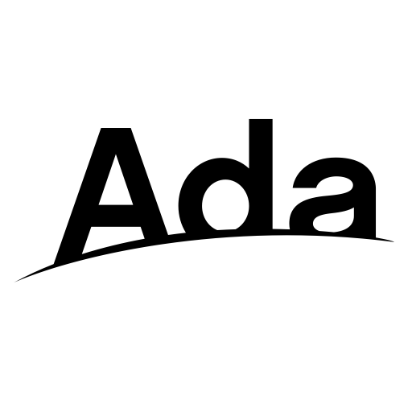

<!-- Logo source: https://raw.githubusercontent.com/AdaCore/learn/main/content/images/ada_horizon_logo/ada_horizon.svg -->

# Ada

Ada is a compiled, strongly typed language designed in the late 1970s for the United States Department of Defense's common-language programme. It descends from Pascal, favours readable words and explicit declarations over terse punctuation, and is standardized rather than owned by one company. Today its clearest niche is long-lived, high-integrity software in areas such as aerospace, rail, defence, medical devices, and industrial control. The [Ada language site](https://ada-lang.io/) is a friendly place to learn more.

This repository contains an educational, unofficial Convex client. It is a demonstration, not a production SDK or a package intended for publication.

## Getting Started

Start with [`examples/basics/convex_example.adb`](examples/basics/convex_example.adb). It queries a fresh counter, starts Live before changing it, applies one idempotent mutation, and checks that HTTP, the mutation result, and Live all agree on `0 -> 1`.

From the repository root, Docker builds the pinned Ada toolchain and runs that exact example against a unique test room:

```sh
./run verify-example ada
```

This proves the canonical example compiles and completes its demonstrated journey. The broader `./run test ada`, `./run verify ada`, and `./run verify-hosted ada` gates cover language-local tests and shared conformance separately.

## Interesting Parts

### Success and failure are two arms of one record

Rust's `Result` and TypeScript's discriminated unions have a great-grandparent: the Ada variant record, in the language since 1983. A `Call_Result`'s physical shape depends on its `Success` discriminant — the `Value` field only exists on the `True` arm, and reading a field from the wrong arm raises `Constraint_Error` instead of handing back garbage.

```ada
type Call_Result (Success : Boolean := False) is record
   case Success is
      when True =>
         Value    : JSON.JSON_Value;
         Has_Logs : Boolean := False;
         Logs     : JSON.JSON_Array;
      when False =>
         Error : Error_Info;
   end case;
end record;

--  TypeScript: const result = await increment({ room, language, runId })
Result : constant Convex.Call_Result :=
  Convex.Mutation (Client, "demo:increment", Args);
```

Every query, mutation, and action comes back through this one type, so the failure path is impossible to forget.

### The socket has one owner, and `task` is a keyword

Ada shipped concurrency as part of the language in 1983 — no threads library, because avionics software could not wait for one. The Live client leans on that: a single `task` owns the WebSocket, and its `entry` declarations are rendezvous points where a caller and the owner briefly meet to exchange data. The `Storage_Size` aspect even sizes the task's stack for the client's four-megabyte message ceiling, declared right on the type.

```ada
--  From client/convex-live.ads: the only door to the socket.
task type Owner_Task with Storage_Size => 16 * 1024 * 1024 is
   entry Configure (Deployment_URL : String);
   --  ... Add and Remove entries edit the subscribed query set
   entry Next
     (Id, Generation : Natural; Found : out Boolean; Item : out Update);
   entry Release_Update (Token : Natural);
   entry Stop;
end Owner_Task;
```

Reads, writes, reconnects, and query-set changes all happen inside that one task, so a data race on the connection cannot be written.

### Live updates arrive through `out` parameters

An Ada function returns exactly one value, so procedures hand back multiple results through `out` parameters — the call site reads like a row of labeled return slots. Add `exit when` to leave a loop mid-body and `delay`, a sleep statement built into the language, and polling a subscription needs no imports at all.

```ada
Convex.Live.Subscribe (Live, "demo:state", Args, Stream, Success, Message);
--  TypeScript: const state = useQuery(api.demo.state, { room: "ada-readme" })
loop
   Convex.Live.Try_Next (Live, Stream, Found, Item);
   exit when Found;
   delay 0.01;
end loop;
Convex.Live.Release (Live, Item);  --  return this delivery's byte budget
```

The first delivery hydrates the query with its current value; after a `demo:increment` mutation, the next one is pushed over the same socket — no HTTP re-poll.

## Status

| Capability | Status |
| --- | --- |
| HTTP queries, mutations, actions, bearer auth, logs, and structured errors | Verified by shared local and hosted conformance at this exact head |
| Live initial values, updates, and `QueryFailed` recovery | Verified by shared local and hosted conformance |
| Remove, five reconnects, generation barriers, and bounded global delivery | Verified by shared local and hosted conformance |
| Production SDK compatibility | Not claimed |

## Example

<!-- BEGIN GENERATED EXAMPLE: examples/basics/convex_example.adb -->
```ada
with Ada.Command_Line;
with Ada.Environment_Variables;
with Ada.Exceptions;
with Ada.Real_Time;
with Ada.Strings.Unbounded;
with Ada.Text_IO;
with Convex;
with Convex.Live;
with GNATCOLL.JSON;
with GNATCOLL.Random;
with Interfaces;

procedure Convex_Example is
   package JSON renames GNATCOLL.JSON;
   package US renames Ada.Strings.Unbounded;
   use type Ada.Real_Time.Time;
   use type Convex.Error_Kind;
   use type JSON.JSON_Value_Type;

   Client : Convex.Client;
   Live   : Convex.Live.Manager;
   Stream : Convex.Live.Subscription;

   function Count_From
     (Value : JSON.JSON_Value; Operation : String) return Long_Long_Integer
   is
      Count  : constant JSON.JSON_Value := Value.Get ("count");
      Number : Long_Float;
   begin
      if Count.Kind = JSON.JSON_Int_Type then
         return Count.Get;
      elsif Count.Kind /= JSON.JSON_Float_Type then
         raise Constraint_Error with Operation & " count is not a JSON number";
      end if;
      Number := Count.Get_Long_Float;
      if Number /= Long_Float'Floor (Number)
        or else Number < Long_Float (Long_Long_Integer'First)
        or else Number > Long_Float (Long_Long_Integer'Last)
      then
         raise Constraint_Error
           with Operation & " count is not a whole 64-bit integer";
      end if;
      return Long_Long_Integer (Number);
   end Count_From;

   function Image (Value : Long_Long_Integer) return String is
      Raw : constant String := Long_Long_Integer'Image (Value);
   begin
      return
        (if Raw (Raw'First) = ' '
         then Raw (Raw'First + 1 .. Raw'Last)
         else Raw);
   end Image;

   -- Keep the OS-random id compact and free of Ada's leading numeric space.
   function Random_Run_Id return String is
      Raw : constant String :=
        Interfaces.Unsigned_32'Image (GNATCOLL.Random.Random_Unsigned_32);
   begin
      return
        "ada-"
        & (if Raw (Raw'First) = ' '
           then Raw (Raw'First + 1 .. Raw'Last)
           else Raw);
   end Random_Run_Id;

   function Next_Value (Operation : String) return JSON.JSON_Value is
      Deadline : constant Ada.Real_Time.Time :=
        Ada.Real_Time.Clock + Ada.Real_Time.To_Time_Span (10.0);
   begin
      loop
         declare
            Found : Boolean;
            Item  : Convex.Live.Update;
         begin
            Convex.Live.Try_Next (Live, Stream, Found, Item);
            if Found then
               if Item.Has_Value then
                  declare
                     Value : constant JSON.JSON_Value := Item.Value;
                  begin
                     Convex.Live.Release (Live, Item);
                     return Value;
                  end;
               elsif Item.Has_Error
                 and then Item.Error.Kind /= Convex.Transport_Error
               then
                  declare
                     Message : constant String :=
                       US.To_String (Item.Error.Message);
                  begin
                     Convex.Live.Release (Live, Item);
                     raise Constraint_Error with Operation & ": " & Message;
                  end;
               end if;
               Convex.Live.Release (Live, Item);
            end if;
         end;
         if Ada.Real_Time.Clock >= Deadline then
            raise Constraint_Error with "timed out waiting for " & Operation;
         end if;
         delay 0.01;
      end loop;
   end Next_Value;

begin
   if not Ada.Environment_Variables.Exists ("CONVEX_URL") then
      raise Constraint_Error with "CONVEX_URL is required";
   end if;
   declare
      Deployment : constant String :=
        Ada.Environment_Variables.Value ("CONVEX_URL");
      Room       : constant String :=
        (if Ada.Command_Line.Argument_Count > 0
         then Ada.Command_Line.Argument (1)
         else "ada-example");
      Args       : constant JSON.JSON_Value := JSON.Create_Object;
      Success    : Boolean;
      Message    : US.Unbounded_String;
   begin
      -- Configure one native Ada client for the deployment supplied by Docker.
      Convex.Open (Client, Deployment);
      Convex.Live.Open (Live, Deployment);
      Args.Set_Field ("room", Room);

      -- Query the room through Convex's documented HTTP endpoint.
      declare
         Current_Result : constant Convex.Call_Result :=
           Convex.Query (Client, "demo:state", Args);
      begin
         if not Current_Result.Success then
            raise Constraint_Error
              with US.To_String (Current_Result.Error.Message);
         end if;
         -- Decode either 0 or 0.0 into the integral counter this example needs.
         declare
            Before : constant Long_Long_Integer :=
              Count_From (Current_Result.Value, "current query");
         begin
            Ada.Text_IO.Put_Line ("current count: " & Image (Before));

            -- Start Live before mutating so the reactive change cannot be missed.
            Convex.Live.Subscribe
              (Live, "demo:state", Args, Stream, Success, Message);
            if not Success then
               raise Constraint_Error with US.To_String (Message);
            end if;

            -- The first Live value hydrates the same query observed over HTTP.
            declare
               Initial : constant Long_Long_Integer :=
                 Count_From
                   (Next_Value ("initial Live value"), "initial Live value");
            begin
               if Initial /= Before then
                  raise Constraint_Error
                    with "initial Live value disagreed with HTTP";
               end if;
               Ada.Text_IO.Put_Line ("live initial count: " & Image (Initial));
            end;

            -- Use an OS-random runId as Convex's mutation idempotency key.
            declare
               Mutation_Args : constant JSON.JSON_Value := JSON.Create_Object;
               Run_Id        : constant String := Random_Run_Id;
            begin
               Mutation_Args.Set_Field ("room", Room);
               Mutation_Args.Set_Field ("language", "ada");
               Mutation_Args.Set_Field ("runId", Run_Id);
               declare
                  Mutation : constant Convex.Call_Result :=
                    Convex.Mutation (Client, "demo:increment", Mutation_Args);
               begin
                  if not Mutation.Success then
                     raise Constraint_Error
                       with US.To_String (Mutation.Error.Message);
                  end if;
                  if not Mutation.Value.Get ("applied") then
                     raise Constraint_Error with "mutation was not applied";
                  end if;
                  declare
                     After : constant Long_Long_Integer :=
                       Count_From (Mutation.Value.Get ("state"), "mutation");
                  begin
                     if After /= Before + 1 then
                        raise Constraint_Error
                          with "mutation returned an unexpected count";
                     end if;
                     Ada.Text_IO.Put_Line ("mutation applied: true");
                     Ada.Text_IO.Put_Line ("mutation count: " & Image (After));

                     -- Receive the mutation through Live without polling HTTP.
                     declare
                        Updated : constant Long_Long_Integer :=
                          Count_From
                            (Next_Value ("updated Live value"),
                             "updated Live value");
                     begin
                        if Updated /= After then
                           raise Constraint_Error
                             with "Live update disagreed with mutation";
                        end if;
                        Ada.Text_IO.Put_Line
                          ("live updated count: " & Image (Updated));
                        Ada.Text_IO.Put_Line
                          ("verified count: "
                           & Image (Before)
                           & " -> "
                           & Image (Updated));
                     end;
                  end;
               end;
            end;
         end;
      end;
   end;
   -- Retire the Live query and both native transports on the success path.
   Convex.Live.Unsubscribe (Live, Stream);
   Convex.Live.Close (Live);
   Convex.Close (Client);
exception
   when E : others =>
      begin
         Convex.Live.Unsubscribe (Live, Stream);
      exception
         when others =>
            null;
      end;
      begin
         Convex.Live.Close (Live);
      exception
         when others =>
            null;
      end;
      begin
         Convex.Close (Client);
      exception
         when others =>
            null;
      end;
      Ada.Text_IO.Put_Line
        (Ada.Text_IO.Standard_Error,
         "Ada example failed: " & Ada.Exceptions.Exception_Message (E));
      Ada.Command_Line.Set_Exit_Status (Ada.Command_Line.Failure);
end Convex_Example;
```
<!-- END GENERATED EXAMPLE -->

## Implementation Notes

This is a native Ada implementation. AWS 25.2.0 provides ordinary HTTP, TLS, sockets, and JSON support, while the Convex request envelopes, WebSocket framing, reconnect state, query changes, and transition handling live in the Ada sources under [`client/`](client/). It does not delegate Convex behaviour to another SDK, the Convex CLI, `curl`, Node.js, or Python.

The public HTTP API uses a discriminated `Call_Result`: success carries a JSON value and failure carries a structured `FunctionError`, `ProtocolError`, `TransportError`, or `ClosedError`. The parser deliberately refuses ambiguous HTTP framing instead of guessing. It also distinguishes an omitted Convex `logLines` field from an explicitly empty array.

Live is coordinated by one Ada owner task. Synchronous add, remove, replacement, reconnect, and close barriers keep other tasks away from the socket. The manager retains at most 64 subscriptions and the newest 16 queued deliveries, with byte budgets as well as count limits. `QueryFailed` reaches the subscriber as a structured error without killing that subscription, so a later valid value can recover it.

Docker pins Alire 2.1.0, GNAT 14.2.1, GPRbuild 25.0.1, AWS 25.2.0, GNATCOLL 25.0.0, libgpr 25.0.0, and XMLAda 25.0.0. The final digest-pinned Debian images contain the native executable closure, CA and OpenSSL data, `/bin/sh`, and the POSIX text tools required by the shared verifier. They run as user `65532:65532` without compilers, package managers, delegated runtimes, or network helper commands.

## Known Issues

1. Live authentication, optimistic updates, mutations and actions over WebSocket, and `TransitionChunk` assembly are deferred. HTTP mutations and actions do work.
2. Values cover Convex's JSON-safe subset. Tagged Convex value conversions are not implemented.
3. HTTP responses are capped at 2 MiB and WebSocket messages at 4 MiB. Parsed response trees, active subscription state, delivery queues, and adapter input all have additional fixed bounds for the 128 MiB runtime.
4. This follows the repository's pinned, undocumented sync profile. Passing local and hosted conformance does not make it an officially supported or production-compatible SDK.
