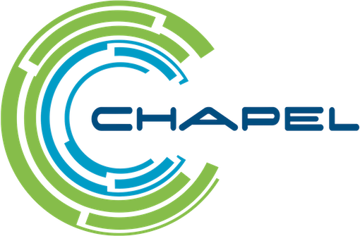

<!-- Logo source: https://chapel-lang.org/images/chapel-logo.png -->

# Chapel

[Chapel](https://chapel-lang.org/) is a compiled language for productive
parallel computing, from a multicore laptop to clusters, GPUs, and
supercomputers. It grew out of Cray's work in DARPA's High Productivity
Computing Systems program and is now an open-source project led by Hewlett
Packard Enterprise with community collaborators. Its C-like surface is meant
to feel approachable to developers coming from C, C++, Fortran, Java, Python,
or MATLAB, while ideas from ZPL, High-Performance Fortran, and Cray's
parallel-C extensions shaped its parallel model. Chapel remains a specialist
language, used mainly in high-performance computing and large-scale data work.

This client is an educational, unofficial demonstration. It is not a
production SDK and is not a package intended for publication.

## Getting Started

The canonical [`examples/basics/main.chpl`](examples/basics/main.chpl) example
queries a fresh counter, subscribes before changing it, runs an idempotent
mutation, and observes the reactive update from `0` to `1`.

From the repository root, run:

```sh
./run verify-example chapel
```

That command builds and runs the exact example in Docker against an isolated
room. You do not need Chapel installed on your machine.

## Interesting Parts

### Mutation data crosses an explicit JSON boundary

**TypeScript with React**

```tsx
import { useMutation } from "convex/react";
import { api } from "./convex/_generated/api";

export function IncrementButton() {
  const increment = useMutation(api.demo.increment);

  async function handleClick() {
    const result = await increment({
      room: "chapel-readme",
      language: "typescript",
      runId: crypto.randomUUID(),
    });
    console.log(result.state.count); // Generated types know this is a number.
  }

  return <button onClick={handleClick}>Increment</button>;
}
```

**Chapel**

```chapel
use Convex;
use ConvexTransport;

const deploymentUrl = environment("CONVEX_URL");
if deploymentUrl.numBytes == 0 then halt("CONVEX_URL is required");
var client = new owned Client(deploymentUrl);
defer client.close(); // The owned client also cleans itself up at scope exit.

const room = "chapel-readme";
const mutationArgs = "{\"room\":" + jsonQuote(room) +
  ",\"language\":\"chapel\",\"runId\":" +
  jsonQuote(randomUUID()) + "}";

const result = client.mutation("demo:increment", mutationArgs);
if !result.ok then halt("mutation failed: ", result.failure.message);

// This client returns raw JSON, so decode and validate the application value.
const (hasState, stateJson) = jsonRaw(result.valueJson, "state");
const (validCount, count) = jsonIntegralField(stateJson, "count");
if !hasState || !validCount then halt("mutation returned an invalid state");
writeln(count);
```

React's generated Convex API carries argument and return types into the
component. This Chapel demonstration deliberately exposes JSON strings and a
`callResult` record, so the caller handles failures and decoding explicitly.
The numeric helper accepts Convex values such as `1.0` only when they are
mathematically integral and fit in a Chapel `int(64)`.

### A Live query has an explicit owner and inbox

**TypeScript with React**

```tsx
import { useQuery } from "convex/react";
import { api } from "./convex/_generated/api";

export function Counter() {
  const room = "chapel-readme";
  const state = useQuery(api.demo.state, { room });

  if (state === undefined) return <p>Loading...</p>;
  return <p>Count: {state.count}</p>; // React rerenders when the query changes.
}
```

**Chapel**

```chapel
use Convex;
use ConvexTransport;

const deploymentUrl = environment("CONVEX_URL");
if deploymentUrl.numBytes == 0 then halt("CONVEX_URL is required");
var client = new owned Client(deploymentUrl);
defer client.close(); // Retires the background Live connection.

const room = "chapel-readme";
const roomArgs = "{\"room\":" + jsonQuote(room) + "}";
const (subscription, failure) = client.subscribe("demo:state", roomArgs);
if failure.isPresent || subscription == nil then
  halt("subscribe failed: ", failure.message);
defer subscription!.close(); // Unsubscribes when this scope ends.

// next() waits for one complete snapshot or update from the bounded inbox.
const update = subscription!.next(10.0);
if !update.available || update.failure.isPresent || !update.hasValue then
  halt("Live did not return a value");
const (validCount, count) = jsonIntegralField(update.valueJson, "count");
if !validCount then halt("Live returned an invalid count");
writeln(count);
```

`useQuery` lets React own subscription setup, teardown, and rerendering. The
command-line Chapel API instead returns a `shared Subscription` and lets the
caller pull updates with blocking `next(timeout)`. Blocking delivery is this
client's API choice, not a Chapel limitation: Chapel has its own task-parallel
constructs, and this client uses a background task to own the WebSocket.

## Status

| Capability | Current state | What that means |
| --- | --- | --- |
| HTTP | Badge earned | Query, mutation, action, bearer-token lifecycle, logs, and structured errors are implemented and pass shared local and hosted black-box conformance. |
| Live | Badge earned | Initial and updated query values, unsubscribe, reconnect-on-drop with exponential backoff, unchanged-rehydration suppression, reactive error recovery, and clean shutdown are implemented and pass shared local and hosted black-box conformance, including a `debugDisconnect`-triggered five-reconnect proof and a `QueryFailed`-then-recovery cycle. |

The shared evaluator awarded both badges from a clean exact-head build: 31 of
31 checks against a local backend and 31 of 31 against the hosted deployment
over real TLS. The manifest still defers Live authentication and tagged Convex
values, so neither is implied by those badges.

## Example

<!-- BEGIN GENERATED EXAMPLE: examples/basics/main.chpl -->
```chapel
module ChapelConvexBasics {
  use IO;
  use Convex;
  use ConvexTransport;

  // Turn the JSON shape used by this demo into an application value. The C
  // JSON transport helper performs exact decimal validation, so 1.0 is valid
  // while fractional, quoted, non-finite, and overflowing counts are rejected.
  proc countFromState(operation: string, stateJson: string): int(64) {
    const (valid, count) = jsonIntegralField(stateJson, "count");
    if !valid then
      halt("decode ", operation, ": count must be an in-range integer");
    return count;
  }

  // Every demonstrated operation is checked before anything claims success.
  proc expectCount(operation: string, actual: int(64), expected: int(64)) {
    if actual != expected then
      halt(operation, " count was ", actual, ", expected ", expected);
  }

  proc requireSuccess(operation: string,
                      const ref result: callResult): string {
    if !result.ok then halt(operation, " failed: ", result.failure.message);
    return result.valueJson;
  }

  proc main(args: [] string) {
    const deploymentUrl = environment("CONVEX_URL");
    if deploymentUrl.numBytes == 0 then halt("CONVEX_URL is required");

    // Create a Convex client connected to the deployment from the environment.
    var client = new owned Client(deploymentUrl);

    // Close the HTTP and Live resources before the example exits.
    defer client.close();

    const room = if args.size > 1 then args[1] else "chapel-example";
    const roomArgs = "{\"room\":" + jsonQuote(room) + "}";

    // Run a Convex query over HTTPS to get this room's current state.
    const currentJson = requireSuccess(
      "current query", client.query("demo:state", roomArgs)
    );

    // Decode the raw JSON into the Chapel integer used by the application.
    const currentCount = countFromState("current query", currentJson);
    expectCount("current query", currentCount, 0);
    writeln("current count: ", currentCount);

    // Start Live before mutating so it cannot miss the demonstrated change.
    const (subscription, subscribeFailure) =
      client.subscribe("demo:state", roomArgs);
    if subscribeFailure.isPresent || subscription == nil then
      halt("subscribe failed: ", subscribeFailure.message);

    // Stop the query on scope exit. Shared ownership keeps an active reader
    // alive until its task has observed the terminal close.
    defer subscription!.close();

    // Convex Live first sends a snapshot. Read and validate it before writing.
    const initial = subscription!.next(10.0);
    if !initial.available || initial.failure.isPresent ||
       !initial.hasValue then
      halt("Live subscription did not deliver its initial value");
    const initialCount = countFromState(
      "initial Live value", initial.valueJson
    );
    expectCount("initial Live value", initialCount, currentCount);
    writeln("live initial count: ", initialCount);

    // Run the mutation over HTTPS. runId is its idempotency key, so a retry
    // cannot accidentally apply a second increment.
    const mutationArgs = "{\"room\":" + jsonQuote(room) +
      ",\"language\":\"chapel\",\"runId\":" +
      jsonQuote(randomUUID()) + "}";
    const mutationJson = requireSuccess(
      "mutation", client.mutation("demo:increment", mutationArgs)
    );
    const (hasApplied, appliedJson) = jsonRaw(mutationJson, "applied");
    if !hasApplied || appliedJson != "true" then
      halt("mutation was not applied");
    writeln("mutation applied: true");
    const (hasState, mutationState) = jsonRaw(mutationJson, "state");
    if !hasState then halt("mutation result omitted state");
    const mutationCount = countFromState("mutation", mutationState);
    expectCount("mutation", mutationCount, 1);
    writeln("mutation count: ", mutationCount);

    // Receive the changed room through Live without another HTTP query.
    const changed = subscription!.next(10.0);
    if !changed.available || changed.failure.isPresent ||
       !changed.hasValue then
      halt("Live subscription did not deliver the changed value");
    const changedCount = countFromState(
      "updated Live value", changed.valueJson
    );
    expectCount("updated Live value", changedCount, 1);
    writeln("live updated count: ", changedCount);

    // Reaching here proves HTTPS and Live agreed on the same 0 -> 1 change.
    writeln("verified count: ", currentCount, " -> ", changedCount);
  }
}
```
<!-- END GENERATED EXAMPLE -->

The block above is projected from the exact source compiled into
`/usr/local/bin/convex-example` and shown on the evidence site.

## Implementation Notes

This is a native Chapel client, not a wrapper around another Convex SDK.
Chapel implements the Convex request envelopes, result handling, Live state
machine, reconnect behavior, and subscription lifecycle. A small C boundary
uses libcurl for HTTP, TLS, and WebSockets and json-c for dynamic JSON parsing,
which is a practical fit because Chapel has direct
[C interoperability](https://chapel-lang.org/docs/technotes/extern.html).

The ownership words in the example are meaningful. `owned Client` gives one
scope responsibility for the client, while `shared Subscription` allows the
background Live task and the consuming task to keep the same subscription
alive safely. Chapel's compiler manages both lifetimes. See the official
[class lifetime documentation](https://chapel-lang.org/docs/language/spec/classes.html)
for the distinction between `owned`, `shared`, `borrowed`, and `unmanaged`.

One background Chapel task owns all WebSocket reads, writes, reconnects, and
query changes. Each subscription keeps the newest 16 complete updates within a
4 MiB limit, with at most 64 subscriptions and a 32 MiB aggregate Live budget.
If a subscription inbox overflows, it drops the oldest update. The API exposes
function, protocol, transport, and closed failures as data so callers can
decide how to handle them.

All development commands run through Docker:

```sh
./run test chapel
./run verify chapel
./run verify-hosted chapel
./run verify-all chapel
```

`test` covers formatting, compilation, unit tests, architecture, hostile HTTP
and WebSocket peers, and bounded shutdown. `verify` and `verify-hosted` run the
canonical example plus shared black-box conformance against local and hosted
deployments. `verify-all` runs both profiles from the same built source.

The toolchain is Chapel 2.8.0, and the final `linux/amd64` images contain the
compiled client programs and their runtime libraries without the Chapel
compiler or a package manager.

## Known Issues

1. Live is pinned to the unversioned sync profile recorded in
   [`manifest.yaml`](manifest.yaml), so it is evidence for that profile rather
   than a promise of compatibility with future protocol changes.
2. Live authentication, optimistic updates, WebSocket mutations, and WebSocket
   actions are deferred. Queries, mutations, and actions do work over HTTP.
3. Live values expose the JSON-safe subset as raw JSON. Tagged Convex values
   and `TransitionChunk` assembly are not implemented.
4. The bounded Live inbox can discard older updates when a consumer falls
   behind. This protects memory but means it is not an event-history API.
