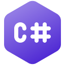

<!-- Logo source: https://github.com/dotnet/brand/blob/main/logo/language-icons/csharp-128.png -->

# C#

C# (pronounced “C sharp”) is a general-purpose, strongly typed language developed at Microsoft and [first released with the .NET initiative in 2000](https://learn.microsoft.com/en-us/dotnet/csharp/language-reference/language-specification/introduction). Its braces and semicolons feel familiar if you know Java, C++, JavaScript, or TypeScript, while features such as garbage collection, records, pattern matching, and `async`/`await` give it a distinctly modern .NET shape.

Today C# is the main language of the cross-platform [.NET](https://dotnet.microsoft.com/en-us/languages/csharp) ecosystem. It is widely used for web services with ASP.NET Core, desktop and mobile applications, cloud systems, and games. Microsoft describes it as one of the five most-used languages in GitHub projects. This repository's client is an educational, unofficial demonstration, not a production SDK or an officially supported Convex client.

## Getting Started

Start with the [canonical basic example](examples/basics/Program.cs). It reads a counter, opens a Live subscription before changing that counter, performs an idempotent mutation, and checks that Live delivers the same new value.

From the repository root, run:

```sh
./run verify-example csharp
```

That command builds and runs the exact example in Docker against a unique room, so concurrent runs cannot interfere with its `0 -> 1` journey.

## Interesting Parts

### JSON is explicit at the C# boundary

In React, Convex's generated API makes the function arguments and result type-safe. This small C# client has no generated model layer, so it constructs and reads JSON nodes directly. The HTTP call is asynchronous, but it is a one-off read rather than a reactive subscription.

**TypeScript with React**

```tsx
import { useQuery } from "convex/react";
import { api } from "../../convex/_generated/api";

export function Counter() {
  const state = useQuery(api.demo.state, { room: "readme-csharp" });

  if (state === undefined) return <p>Loading...</p>;
  return <p>{state.count}</p>; // Generated Convex types know this is a number.
}
```

**C#**

```csharp
using System.Text.Json.Nodes;
using Convex;

var roomArgs = new JsonObject { ["room"] = "readme-csharp" };
using var client = new ConvexClient(Environment.GetEnvironmentVariable("CONVEX_URL")!);

var result = await client.Query("demo:state", roomArgs); // One HTTP request, not a subscription.
var state = result.Value
    ?? throw new InvalidOperationException("demo:state returned null");
var count = CountValue.Read(state, "demo:state"); // Validate the JSON number before using it.
Console.WriteLine(count);
```

The example's [`CountValue.Read`](examples/basics/CountValue.cs) also accepts integral JSON values such as `1.0`, while rejecting fractions, strings, non-finite numbers, and values outside `Int32` range. That care is necessary because the wire value is JSON, even though the rest of the C# program is strongly typed.

### A command-line program owns its Live subscription

React creates and cleans up a subscription as the component and its arguments change. This client exposes that lifecycle directly. It starts Live before the mutation, reads the initial value, performs the mutation over HTTP, and then waits for the reactive update.

**TypeScript with React**

```tsx
import { useMutation, useQuery } from "convex/react";
import { api } from "../../convex/_generated/api";

export function LiveCounter() {
  const room = "readme-csharp-live";
  const state = useQuery(api.demo.state, { room }); // React owns the Live subscription.
  const increment = useMutation(api.demo.increment);

  async function addOne() {
    const result = await increment({
      room,
      language: "typescript",
      runId: crypto.randomUUID(),
    });
    console.log(result.state.count); // The mutation result is type-safe here.
  }

  if (state === undefined) return <p>Loading...</p>;
  // A later render receives state.count after Convex pushes the update.
  return <button onClick={addOne}>Count: {state.count}</button>;
}
```

**C#**

```csharp
using System.Text.Json.Nodes;
using Convex;

var room = "readme-csharp-live";
var roomArgs = new JsonObject { ["room"] = room };
using var http = new ConvexClient(Environment.GetEnvironmentVariable("CONVEX_URL")!);
using var live = new LiveClient(Environment.GetEnvironmentVariable("CONVEX_URL")!);
using var subscription = await live.Subscribe("demo:state", roomArgs);

var initial = CountValue.Read(
    subscription.Next(TimeSpan.FromSeconds(10)), // This client chooses a blocking read.
    "initial Live value"
);

var mutation = await http.Mutation(
    "demo:increment",
    new JsonObject
    {
        ["room"] = room,
        ["language"] = "csharp",
        ["runId"] = Guid.NewGuid().ToString(), // The backend uses this as an idempotency key.
    }
);
var returned = CountValue.Read(mutation.Value!["state"]!, "mutation result");
var updated = CountValue.Read(
    subscription.Next(TimeSpan.FromSeconds(10)),
    "Live update"
);
Console.WriteLine($"{initial} -> {returned} -> {updated}");
```

C# supports callbacks and asynchronous streams. The blocking `Next` operation is a deliberate API choice in this compact command-line demonstration, not a limitation of the language. Disposing the subscription sends its removal, while disposing both clients closes their network resources.

## Status

| Capability | Status |
| --- | --- |
| JSON HTTP queries, mutations, and actions | Verified by shared local and hosted conformance |
| Live query subscriptions | Verified by shared local and hosted conformance |
| Authentication | HTTP bearer tokens only |

The implementation is native C# on .NET 8. It uses .NET's HTTP, JSON, and WebSocket libraries, but implements the Convex-specific request and Live sync behavior itself.

## Example

<!-- BEGIN GENERATED EXAMPLE: examples/basics/Program.cs -->
```csharp
using System.Text.Json.Nodes;
using Convex;

// Read configuration from the verifier rather than baking a deployment into the image.
var url =
    Environment.GetEnvironmentVariable("CONVEX_URL")
    ?? throw new InvalidOperationException("CONVEX_URL is required");

// A unique room means other example runs cannot change this counter.
var room = args.Length == 0 ? "csharp-example" : args[0];
var roomArgs = new JsonObject { ["room"] = room };

// One native HTTP client and one Live connection are cleaned up even when a check fails.
using var client = new ConvexClient(url);
using var live = new LiveClient(url);

// Read the documented JSON HTTP query and decode the idiomatic JSON value.
var before = CountValue.Read(
    (await client.Query("demo:state", roomArgs)).Value
        ?? throw new InvalidOperationException("current query returned null"),
    "current query"
);

// Start Live before the mutation so this first value establishes our observation point.
using var subscription = await live.Subscribe("demo:state", roomArgs);
var initial = CountValue.Read(subscription.Next(TimeSpan.FromSeconds(10)), "initial Live value");
if (initial != before)
    throw new InvalidOperationException("Live initial value disagreed");

// runId is the mutation's idempotency key, avoiding a double increment after a retry.
var mutation = await client.Mutation(
    "demo:increment",
    new JsonObject
    {
        ["room"] = room,
        ["language"] = "csharp",
        ["runId"] = Guid.NewGuid().ToString(),
    }
);
var mutationValue = mutation.Value ?? throw new InvalidOperationException("mutation returned null");
var applied = mutationValue["applied"]?.GetValue<bool>() ?? false;
if (!applied)
    throw new InvalidOperationException("mutation was not applied");
var after = CountValue.Read(mutationValue["state"]!, "mutation");
if (after != before + 1)
    throw new InvalidOperationException("mutation count was unexpected");

// Consume the corresponding Live update, then print only when every observation agrees.
var updated = CountValue.Read(subscription.Next(TimeSpan.FromSeconds(10)), "updated Live value");
if (updated != after)
    throw new InvalidOperationException("Live update disagreed");
Console.WriteLine($"current count: {before}");
Console.WriteLine($"live initial count: {initial}");
Console.WriteLine($"mutation applied: {applied.ToString().ToLowerInvariant()}");
Console.WriteLine($"mutation count: {after}");
Console.WriteLine($"live updated count: {updated}");
Console.WriteLine($"verified count: {before} -> {updated}");
```
<!-- END GENERATED EXAMPLE -->

## Implementation Notes

[`ConvexClient`](client/ConvexClient.cs) posts queries, mutations, and actions to the JSON HTTP API. It deep-clones each caller-owned `JsonObject`, so the same arguments can be safely reused, and separates function failures from transport and protocol failures. `SetAuth` adds a bearer token to HTTP calls only.

[`LiveClient`](client/LiveClient.cs) connects with `ClientWebSocket` to the pinned `convex-rs-0.10.4-unversioned-sync` profile at `/api/sync`. It tracks the active query set, validates transition versions, decodes fragmented UTF-8 messages, and reconnects with bounded exponential backoff. A single receive loop handles server messages, while a semaphore protects connection and subscription state.

Each subscription keeps only its newest 16 updates. A slow consumer can therefore miss intermediate values, but cannot grow the delivery queue without bound. The language-local tests cover queue overflow, UTF-8 fragmentation, structured errors, stale events after unsubscribe or replacement, and reconnecting with active subscriptions.

The Docker build pins .NET SDK 8.0.408 and the .NET 8.0.15 runtime for `linux/amd64`. The published images retain the .NET runtime but remove SDK, compiler, package-manager, Node.js, Python, and Convex CLI commands. Both the example and conformance adapter run as user `65532:65532`.

For the repository's evidence layers, `./run test csharp` compiles and exercises the language-local tests in Docker, while `./run verify csharp` and `./run verify-hosted csharp` are the separate shared conformance runs.

## Known Issues

1. Authentication is implemented for JSON HTTP calls only. Live authentication is deferred.
2. Mutations and actions use HTTP. Sending them over the Live WebSocket is not implemented.
3. Transition chunks, optimistic updates, journals, and replay are outside the pinned Live profile implemented here.
4. A slow Live consumer receives the newest 16 buffered updates and may miss older intermediate states.
