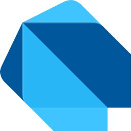

<!-- Logo source: https://services.google.com/fh/files/misc/dart_brand_guidelines_assets.zip -->

# Dart

[Dart](https://dart.dev/) is a type-safe, garbage-collected language with
familiar C-style syntax. It was first released in 2011 as an embeddable,
multi-platform language, then [Dart 2 refocused it on client development](https://dart.dev/blog/announcing-dart-2-optimized-for-client-side-development).
Today its best-known niche is powering Flutter apps, though the SDK can also
compile command-line and server programs to native machine code or target the
web through JavaScript and WebAssembly.

This repository's client is educational, unofficial, and not a production SDK
or publishable package. Dart and the related logo are trademarks of Google LLC.
We are not endorsed by or affiliated with Google LLC.

## Getting Started

Start with the [canonical basic example](examples/basics/main.dart). It queries
a fresh counter, opens a Live subscription before mutating that counter, checks
the reactive update, and cleans up both resources. From the repository root,
Docker builds and runs that exact program against a unique test room:

```sh
./run verify-example dart
```

The command needs Docker, but it does not require a Dart SDK on your host.

## Interesting Parts

### A typed hook meets a JSON boundary

**TypeScript with React**

```tsx
import { useQuery } from "convex/react";
import { api } from "./convex/_generated/api";

export function CounterReadout() {
  const state = useQuery(api.demo.state, { room: "readme-dart-query" });
  if (state === undefined) return <p>Loading...</p>;

  const count = state.count; // Generated types know this is a number.
  return <p>Count: {count}</p>;
}
```

**Dart**

```dart
import 'dart:io';

import 'client/convex_client.dart';

Future<void> main() async {
  final deploymentUrl = Platform.environment['CONVEX_URL'];
  if (deploymentUrl == null || deploymentUrl.isEmpty) {
    throw StateError('CONVEX_URL is required');
  }

  final client = ConvexClient(deploymentUrl);
  try {
    final result = await client.query('demo:state', {
      'room': 'readme-dart-query', // Dart maps become Convex argument objects.
    });
    final state = result.value;
    if (state is! Map || state['count'] is! num) {
      throw FormatException('demo:state returned an unexpected value');
    }
    // Convex numbers decode as num; validate before choosing an int.
    final count = (state['count'] as num).toInt();
    stdout.writeln('Count: $count');
  } finally {
    await client.close();
  }
}
```

The generated React API carries the function's result type into the component.
This small Dart client deliberately returns decoded JSON as `Object?`, so the
application validates and maps the shape it needs. The Dart call is also a
one-off HTTP query, unlike `useQuery`, which stays subscribed while the React
component is mounted.

### A Live query is an ordinary Dart stream

**TypeScript with React**

```tsx
import { useMutation, useQuery } from "convex/react";
import { api } from "./convex/_generated/api";

export function LiveCounter() {
  const room = "readme-dart-live";
  const state = useQuery(api.demo.state, { room });
  const increment = useMutation(api.demo.increment);

  return (
    <button
      disabled={state === undefined}
      onClick={() =>
        increment({
          room,
          language: "typescript",
          runId: crypto.randomUUID(),
        })
      }
    >
      Count: {state?.count ?? "loading"}
    </button>
  ); // React owns the subscription and refreshes this render automatically.
}
```

**Dart**

```dart
import 'dart:async';
import 'dart:io';

import 'client/convex_client.dart';
import 'client/live_client.dart';

Future<void> main() async {
  final deploymentUrl = Platform.environment['CONVEX_URL'];
  if (deploymentUrl == null || deploymentUrl.isEmpty) {
    throw StateError('CONVEX_URL is required');
  }

  final client = ConvexClient(deploymentUrl);
  final subscription = await client.subscribe('demo:state', {
    'room': 'readme-dart-live',
  });
  // One iterator stays attached, so no update is lost between reads.
  final updates = StreamIterator<LiveUpdate>(subscription.updates);
  try {
    if (!await updates.moveNext()) throw StateError('Live stream closed');
    if (updates.current.error != null) throw updates.current.error!;
    stdout.writeln('Initial: ${updates.current.value}');

    await client.mutation('demo:increment', {
      'room': 'readme-dart-live',
      'language': 'dart',
      'runId': 'dart-readme-${DateTime.now().microsecondsSinceEpoch}',
    });

    if (!await updates.moveNext()) throw StateError('Live stream closed');
    if (updates.current.error != null) throw updates.current.error!;
    stdout.writeln('Updated: ${updates.current.value}'); // Reactive value.
  } finally {
    await updates.cancel();
    await subscription.close(); // The command-line program owns this lifecycle.
    await client.close();
  }
}
```

Dart supports asynchronous streams directly. This client chooses to expose
Live results as a single-listener `Stream<LiveUpdate>` and makes callers close
the subscription explicitly. React hides those details behind component mount,
rerender, and unmount behavior.

## Status

| Capability | Status |
| --- | --- |
| Native Dart implementation | Verified by shared local and hosted conformance |
| HTTP query, mutation, action, and bearer-token lifecycle | Verified by shared local and hosted conformance |
| Experimental Live query and reconnect support | Verified by shared local and hosted conformance |
| Earned capability badges | HTTP and Live |

## Example

<!-- BEGIN GENERATED EXAMPLE: examples/basics/main.dart -->
```dart
import 'dart:async';
import 'dart:convert';
import 'dart:io';
import 'dart:math';

import '../../client/convex_client.dart';
import '../../client/live_client.dart';

Future<void> main(List<String> arguments) async {
  final deploymentUrl = Platform.environment['CONVEX_URL'];
  if (deploymentUrl == null || deploymentUrl.isEmpty) {
    stderr.writeln('CONVEX_URL is required');
    exitCode = 2;
    return;
  }

  // Create a Convex client connected to the deployment selected by the environment.
  final client = ConvexClient(deploymentUrl);
  final room = arguments.isEmpty ? 'dart-example' : arguments.first;
  try {
    // Run a Convex query over HTTP to get this room's current counter state.
    final current = await client.query('demo:state', {'room': room});
    final currentCount = _count('current query', current.value);
    stdout.writeln('current count: $currentCount');

    // Start Live before changing the counter so the initial snapshot and next
    // update prove that the subscription observed this exact mutation.
    final subscription = await client.subscribe('demo:state', {'room': room});
    // Keep one listener attached for both values. A Live stream is a sequence,
    // so reopening a one-listener stream after the mutation could miss an update.
    final updates = StreamIterator(subscription.updates);
    try {
      // The first Live value is the server's current state, not a cached HTTP result.
      final initial = await _nextValue(updates);
      final initialCount = _count('initial Live value', initial);
      _expect('initial Live value', initialCount, currentCount);
      stdout.writeln('live initial count: $initialCount');

      // Give the mutation a fresh idempotency key. Retrying this same key asks
      // Convex for the existing result instead of incrementing the room twice.
      final mutation = await client.mutation('demo:increment', {
        'room': room,
        'language': 'dart',
        'runId': _runId(),
      });
      final applied = _readMutation(mutation.value);
      if (!applied.applied) throw StateError('mutation was not applied');
      stdout.writeln('mutation applied: ${applied.applied}');
      final expected = currentCount + 1;
      _expect('mutation', applied.count, expected);
      stdout.writeln('mutation count: ${applied.count}');

      // Receive the changed counter from the existing Live stream, without a second HTTP query.
      final updated = await _nextValue(updates);
      final updatedCount = _count('updated Live value', updated);
      _expect('updated Live value', updatedCount, expected);
      stdout.writeln('live updated count: $updatedCount');

      // Only print the universal final verification line after every included operation agrees.
      stdout.writeln('verified count: $currentCount -> $updatedCount');
    } finally {
      // Stop the reactive query before the client closes its socket.
      await updates.cancel();
      await subscription.close();
    }
  } finally {
    // Close the HTTP client and its Live socket when this teaching example exits.
    await client.close();
  }
}

Future<Object?> _nextValue(StreamIterator<LiveUpdate> updates) async {
  // Bound the wait so a broken Live connection fails the example instead of
  // hanging forever, and turn a structured Live failure back into an error.
  final hasUpdate = await updates.moveNext().timeout(
    const Duration(seconds: 10),
  );
  if (!hasUpdate)
    throw StateError('Live subscription closed before delivering an update');
  final update = updates.current;
  if (update.error != null) throw update.error!;
  return update.value;
}

int _count(String operation, Object? value) {
  // Decode the JSON object into the simple Dart value this example needs while
  // rejecting a surprising server result rather than printing false success.
  if (value is! Map || value['count'] is! num) {
    throw FormatException(
      '$operation did not return a numeric count: ${jsonEncode(value)}',
    );
  }
  return (value['count'] as num).toInt();
}

({bool applied, int count}) _readMutation(Object? value) {
  // The mutation returns both idempotency status and the new counter state, so
  // validate both fields before trusting either one.
  if (value is! Map || value['applied'] is! bool || value['state'] is! Map) {
    throw FormatException(
      'mutation did not return the expected shape: ${jsonEncode(value)}',
    );
  }
  return (
    applied: value['applied'] as bool,
    count: _count('mutation state', value['state']),
  );
}

void _expect(String operation, int actual, int expected) {
  // Each demonstrated step must agree with the expected 0 -> 1 journey.
  if (actual != expected)
    throw StateError('$operation count was $actual, expected $expected');
}

String _runId() =>
    // A random key makes this run unique while still allowing Convex to dedupe
    // a retry of the same mutation request.
    List<int>.generate(
      16,
      (_) => Random.secure().nextInt(256),
    ).map((byte) => byte.toRadixString(16).padLeft(2, '0')).join();
```
<!-- END GENERATED EXAMPLE -->

The block above is generated from the canonical runnable source. If that source
changes, `./run sync-examples` updates both the README and website copy.

## Implementation Notes

The public client has no third-party package dependencies. It uses Dart's
standard `dart:io` HTTP, TLS, and WebSocket support plus `dart:convert` for JSON,
then implements the Convex-specific request and Live behavior in Dart. HTTP
calls return `Future<ConvexResult>` values and distinguish function, protocol,
transport, and closed-client failures with a sealed error hierarchy.

One `LiveClient` serializes socket ownership, reconnects, and subscription
changes. Each subscription feeds a single-listener stream through a bounded
newest-16 relay, dropping the oldest queued update if a consumer falls behind.
That protects socket processing from an unbounded Dart `StreamController`
queue. The implementation also suppresses an unchanged value after reconnect.

Docker pins Dart SDK 3.7.2 and compiles the example and test adapter into
`linux/amd64` AOT executables. The final images include their runtime library
closure and CA certificates, but no Dart command, compiler, package manager,
Node.js, Python, or Convex CLI. The experimental Live implementation targets
the unversioned `/api/sync` behavior pinned to convex-rs 0.10.4 source commit
`6f1df8a8ba1665084ec001e307ca841ca17074d7`.

## Known Issues

1. Live authentication and token rotation are not implemented.
2. Values are limited to JSON-safe data. Full tagged Convex value types are not
   decoded by this demonstration.
3. WebSocket mutations and actions, query journals, optimistic updates, and
   `TransitionChunk` assembly are deferred. The HTTP and Live capabilities in
   the status table are still backed by shared local and hosted conformance.
