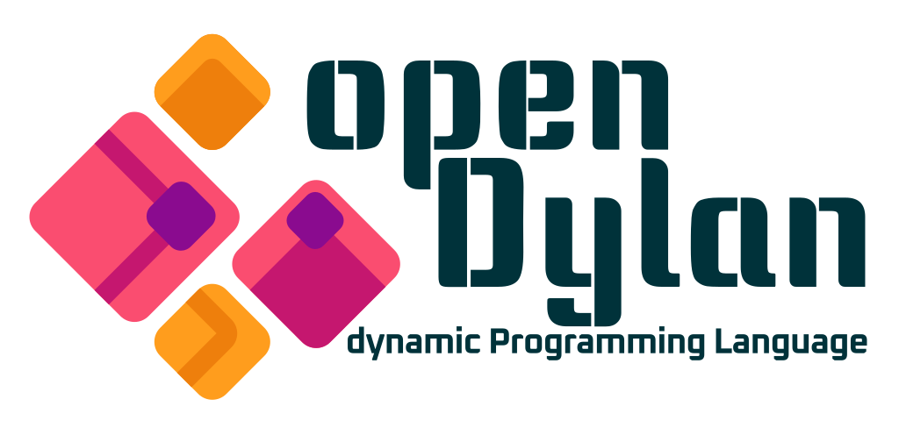

<!-- Logo source: https://opendylan.org/_static/images/opendylan-light.png -->

# Dylan

Dylan is a general-purpose, object-oriented language created at Apple in the
early 1990s, initially with the Newton in mind. Scheme and Common Lisp shaped
its object model, but the modern language uses readable infix syntax rather
than Lisp parentheses. It combines dynamic-language features such as multiple
dispatch and macros with optional type constraints that help a compiler produce
efficient native code. The [official history](https://package.opendylan.org/opendylan/history/)
and [Open Dylan tour](https://opendylan.org/about/) are good introductions.

Today Dylan is a small but active open source niche centred on the
[Open Dylan compiler and libraries](https://opendylan.org/). This repository
uses it for a native network client, which is a practical way to see how its
types, multiple return values, modules, and C foreign-function interface feel
in real code. This is an educational, unofficial demonstration, not a
production SDK and not supported by Convex.

## Getting Started

Start with the canonical
[`examples/basics/main.dylan`](examples/basics/main.dylan). It queries a fresh
counter, subscribes to that same counter before changing it, applies one
idempotent mutation, and waits for the reactive `0 -> 1` update.

From the repository root, run:

```sh
./run verify-example dylan
```

That command builds and runs the exact example in Docker against a unique test
room, then checks its concise stdout transcript. It does not install Open Dylan
on your host.

## Interesting Parts

### One call can return a value, an error, and logs

**TypeScript with React**

```tsx
import { useQuery } from "convex/react";
import { api } from "../convex/_generated/api";

export function CounterRead() {
  const room = "readme-dylan";
  const state = useQuery(api.demo.state, { room });

  if (state === undefined) return <p>Loading...</p>;
  return <p>Count: {state.count}</p>; // state.count is type-safe here.
}
```

**Dylan**

```dylan
let url-text = cx-getenv("CONVEX_URL");
if (~url-text) error("CONVEX_URL is required") end if;
let base-url = parse-convex-url(url-text);
if (~base-url) error("CONVEX_URL is not a valid http(s) URL") end if;
// The Docker entrypoint maps the verifier's unique room to EXAMPLE_ROOM.
let room = cx-getenv("EXAMPLE_ROOM");
if (~room) error("EXAMPLE_ROOM is required") end if;
// Dylan uses #f for false and, here, for "no authentication token".
let query-args = make-json-object();
json-object-set!(query-args, "room", room); // Build { room } explicitly.

let (state, query-error, _logs) =
  convex-http-call(base-url, "query", "demo:state", query-args, #f,
                   cx-now-ms() + 15000);
if (query-error)
  error(query-error.err-message); // The error is separate from the value.
end if;
let count = count-of(state); // Validate the decoded JSON before using it.
```

Dylan functions can return several values directly, so the client returns the
result, a structured error, and Convex log lines without wrapping them in a
result object. This Dylan call is a one-off HTTP request. Unlike `useQuery`, it
does not stay subscribed or trigger a render when the data changes.

### The command-line client owns the reactive lifetime

**TypeScript with React**

```tsx
import { useMutation, useQuery } from "convex/react";
import { api } from "../convex/_generated/api";

export function CounterButton() {
  const room = "readme-dylan-live";
  const state = useQuery(api.demo.state, { room });
  const increment = useMutation(api.demo.increment);

  if (state === undefined) return <p>Loading...</p>;

  async function addOne() {
    const result = await increment({
      room,
      language: "TypeScript",
      runId: crypto.randomUUID(),
    });
    console.log(result.state.count); // The mutation also returns the new state.
  }

  // useQuery keeps this label reactive after the mutation.
  return <button onClick={addOne}>Count: {state.count}</button>;
}
```

**Dylan**

```dylan
let url-text = cx-getenv("CONVEX_URL");
if (~url-text) error("CONVEX_URL is required") end if;
let base-url = parse-convex-url(url-text);
if (~base-url) error("CONVEX_URL is not a valid http(s) URL") end if;
// The verifier supplies a fresh room through the Docker entrypoint.
let room = cx-getenv("EXAMPLE_ROOM");
if (~room) error("EXAMPLE_ROOM is required") end if;
let query-args = make-json-object();
json-object-set!(query-args, "room", room);

let manager = sync-manager-new(base-url); // This program owns the connection.
let query-id =
  sync-subscribe(manager, "demo:state", query-args, cx-now-ms() + 8000);
let initial = await-update(manager, query-id, cx-now-ms() + 10000);
let initial-count = count-of(initial.upd-value); // The first Live value.

let mutation-args = make-json-object();
json-object-set!(mutation-args, "room", room);
json-object-set!(mutation-args, "language", "Dylan");
json-object-set!(mutation-args, "runId", concatenate(room, "-once"));
let (result, mutation-error, _logs) =
  convex-http-call(base-url, "mutation", "demo:increment", mutation-args,
                   #f, cx-now-ms() + 15000); // #f means no auth token.
if (mutation-error)
  error(mutation-error.err-message);
end if;
let mutation-count = count-of(json-object-ref(result, "state"));
// The subscription was started first, so the 0 -> 1 update cannot be missed.
let updated = await-update(manager, query-id, cx-now-ms() + 10000);
let updated-count = count-of(updated.upd-value); // The reactive value is now 1.
sync-unsubscribe(manager, query-id, cx-now-ms() + 5000); // Explicit cleanup.
```

React mounts and cleans up the `useQuery` subscription for the component. The
Dylan API instead exposes a manager, a subscription ID, a blocking
`await-update` helper, and explicit unsubscribe. Blocking here is this client's
small command-line API design, not a limitation of the Dylan language. The
`concatenate(room, "-once")` run ID is safe in this example because the
verifier creates a new room for every run. A reusable application should
generate an operation ID and reuse it only when retrying that same logical
mutation.

## Status

| Capability | State | Notes |
| --- | --- | --- |
| HTTP query, mutation, action | Verified | Hand-written HTTP/1.1 over the native transport layer |
| Structured Convex errors | Verified | `FunctionError`, `ProtocolError`, and `TransportError` preserve names, messages, data, and log lines |
| TLS certificate and hostname verification | Verified | Covered by local private-CA tests and hosted evidence |
| Live subscribe, update, unsubscribe | Verified | RFC 6455 framing and the sync state machine are written in Dylan |
| WebSocket handshake verification | Verified | Checks `Sec-WebSocket-Accept` using SHA-1 from libcrypto |
| Live reconnect and rehydration | Verified | Five real reconnects were covered, with unchanged rehydration suppressed |
| Live authentication, optimistic updates, WebSocket mutations | Not implemented | Deferred in the current client |
| Earned badges | **HTTP, Live** | Existing evidence records 31/31 shared checks on local and hosted profiles |

These are evidence-backed repository results, not a claim that this README
reran conformance. The manifest records native provenance, Open Dylan 2026.2,
`linux/amd64`, and the pinned sync profile used for those results.

## Example

<!-- BEGIN GENERATED EXAMPLE: examples/basics/main.dylan -->
```text
module: convex

// -------------------------------------------------------------------------
// Convex from Dylan: the canonical basics example.
//
// Demonstrates the shared counter's 0 -> 1 journey: an initial HTTP
// query, an initial Live value over WebSocket, an idempotent mutation,
// and the resulting Live update -- verifying every step before printing
// the final confirmation line. Stdout here is a universal happy-path
// transcript compared byte-for-byte against
// _shared/examples/basics.expected.txt, so every diagnostic goes to
// stderr instead.
// -------------------------------------------------------------------------

define function die (message :: <byte-string>) => ()
  format-err(message);
  format-err("\n");
  force-err();
  c-exit(1);
end function;

// Convex's "json" HTTP format may render a whole count as either 0 or
// 0.0; this accepts both without silently truncating a genuinely
// fractional value (see convex-json.dylan's header comment on why floats
// and integers are distinct Dylan types here).
define function count-of (value :: <object>)
 => (count :: false-or(<integer>))
  let count-value = json-object-ref(value, "count");
  if (instance?(count-value, <integer>))
    count-value
  elseif (instance?(count-value, <float>))
    let whole = truncate(count-value);
    if (as(<double-float>, whole) = count-value) whole else #f end if
  else
    #f
  end if
end function;

// Blocks (via the same reactor step the adapter uses) until the next
// value or error arrives for query-id, or the overall deadline passes.
define function await-update
    (mgr :: <sync-manager>, query-id :: <integer>, deadline-ms :: <integer>)
 => (update :: false-or(<sync-update>))
  block (done)
    while (#t)
      let update = sync-poll-update(mgr, query-id);
      if (update)
        done(update);
      end if;
      if (cx-now-ms() > deadline-ms)
        done(#f);
      end if;
      sync-pump(mgr, 50);
    end while;
    #f
  end block
end function;

define function main () => ()
  // Configuration: the deployment URL comes from the environment, and
  // the verifier passes a unique room as this container's first
  // argument, forwarded here as EXAMPLE_ROOM by the Docker entrypoint
  // wrapper so a human running the image directly can also just set it.
  let url-text = cx-getenv("CONVEX_URL");
  if (~url-text)
    die("CONVEX_URL is required");
  end if;
  let base-url = parse-convex-url(url-text);
  if (~base-url)
    die("CONVEX_URL is not a valid http(s) URL");
  end if;
  let room = cx-getenv("EXAMPLE_ROOM") | "dylan-basic-example";

  let query-args = make-json-object();
  json-object-set!(query-args, "room", room);

  // The HTTP query: ask Convex for the room's current state.
  let (initial-value, query-err, _query-logs) =
    convex-http-call(base-url, "query", "demo:state", query-args, #f,
                      cx-now-ms() + 15000);
  if (query-err | count-of(initial-value) ~= 0)
    die("unexpected initial query value");
  end if;
  format-out("current count: 0\n");

  // Start Live before the mutation so no reactive update can be missed.
  let mgr = sync-manager-new(base-url);
  let query-id =
    sync-subscribe(mgr, "demo:state", query-args, cx-now-ms() + 8000);
  let initial-live = await-update(mgr, query-id, cx-now-ms() + 10000);
  if (~initial-live | initial-live.upd-kind ~= #"value"
        | count-of(initial-live.upd-value) ~= 0)
    die("unexpected initial Live value");
  end if;
  format-out("live initial count: 0\n");

  // The run ID makes the mutation safe to retry without incrementing
  // twice.
  let mutation-args = make-json-object();
  json-object-set!(mutation-args, "room", room);
  json-object-set!(mutation-args, "language", "Dylan");
  json-object-set!(mutation-args, "runId", concatenate(room, "-once"));
  let (mutation-value, mutation-err, _mutation-logs) =
    convex-http-call(base-url, "mutation", "demo:increment", mutation-args,
                      #f, cx-now-ms() + 15000);
  if (mutation-err)
    die("mutation failed");
  end if;
  let applied = json-object-ref(mutation-value, "applied");
  let state = json-object-ref(mutation-value, "state");
  if (applied ~= #t | count-of(state) ~= 1)
    die("unexpected mutation result");
  end if;
  format-out("mutation applied: true\n");
  format-out("mutation count: 1\n");

  // Decode the resulting Live update, then cleanly remove the
  // subscription.
  let updated-live = await-update(mgr, query-id, cx-now-ms() + 10000);
  if (~updated-live | updated-live.upd-kind ~= #"value"
        | count-of(updated-live.upd-value) ~= 1)
    die("unexpected updated Live value");
  end if;
  format-out("live updated count: 1\n");
  sync-unsubscribe(mgr, query-id, cx-now-ms() + 5000);

  // Print verification only after HTTP and Live agree on the 0 -> 1
  // journey.
  format-out("verified count: 0 -> 1\n");
  force-out();
end function;

main();
```
<!-- END GENERATED EXAMPLE -->

## Implementation Notes

The client is native Dylan. It does not call another Convex SDK, Node.js,
Python, `curl`, or the Convex CLI. Dylan code implements JSON, HTTP/1.1,
WebSocket framing, and the pinned Live sync behaviour. Its only foreign calls
are POSIX socket and polling functions plus OpenSSL, declared directly with
Dylan's `define C-function`. There is no separate C support file.

Open Dylan resolves the source records listed by each `.lid` project beside
that project file. The repository keeps one clear educational copy of each
client source, so the Docker build assembles a temporary directory for each
executable before compiling it:

| File | Responsibility |
| --- | --- |
| [`client/convex-native.dylan`](client/convex-native.dylan) | POSIX and OpenSSL foreign-function declarations |
| [`client/convex-json.dylan`](client/convex-json.dylan) | JSON values represented by Dylan strings, tables, vectors, numbers, and booleans |
| [`client/convex-http.dylan`](client/convex-http.dylan) | HTTP framing and Convex query, mutation, and action calls |
| [`client/convex-ws.dylan`](client/convex-ws.dylan) | WebSocket masking, fragmentation, control frames, and UTF-8 validation |
| [`client/convex-sync.dylan`](client/convex-sync.dylan) | One-owner Live reactor and bounded per-subscription queues |

One call path, `sync-pump`, owns WebSocket reads, writes, reconnects, and query
set changes. The example and conformance adapter call that reactor explicitly,
so Live only progresses while it is being pumped. On reconnect, the client
resends active subscriptions and suppresses an unchanged first value so callers
do not see a duplicate update.

TLS setup explicitly enables certificate and hostname checks. The WebSocket
handshake also recomputes `Sec-WebSocket-Accept` with libcrypto's SHA-1 rather
than trusting any HTTP 101 response. Language-local tests cover trusted,
untrusted, and wrong-host certificate cases, framing details, JSON behaviour,
and the sync state machine.

The conformance adapter is test infrastructure rather than part of the public
client API. It adds `debugDisconnect` so shared tests can force reconnects.
The underlying `/api/sync` profile is pinned but undocumented, so this project
does not claim it is a stable public Convex protocol.

## Known Issues

1. Live authentication, optimistic updates, WebSocket mutations and actions,
   and `TransitionChunk` assembly are not implemented.
2. Live values support Convex's JSON-safe subset. Tagged
   `convex_encoded_json` values are deferred.
3. Live is single-threaded and advances only while `sync-pump` runs. Local
   state-machine tests use hand-built transitions instead of an in-process
   fixture WebSocket server.
4. Each subscription holds at most 64 pending updates and drops the oldest on
   overflow. Live text messages and HTTP responses are capped at 2 MiB.
5. The client keeps one session ID for its lifetime and reuses it after a
   reconnect. That is a deliberate implementation choice recorded in the
   source, not a documented Convex guarantee.
6. Open Dylan has no standard source formatter. Docker enforces spaces, final
   newlines, no trailing whitespace, and repository line-length limits instead.
