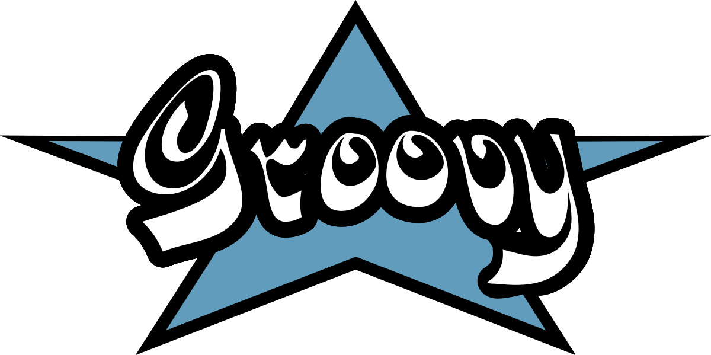

<!-- Logo source: https://apache.org/logos/res/groovy/groovy.png -->

# Groovy

[Apache Groovy](https://groovy-lang.org/) is a Java-like language for the JVM. The project began in 2003 and reached 1.0 in January 2007. Groovy can be dynamically or statically typed, interoperates directly with Java, and is now most at home in JVM scripting, build and test automation, web applications, and readable domain-specific languages.

This client uses Groovy 4 to make Convex HTTP calls and maintain a live query. It is an educational, unofficial demonstration, not a production SDK or a package intended for publication.

## Getting Started

Read [`examples/basics/Main.groovy`](examples/basics/Main.groovy) for the complete `0 -> 1` counter journey. From the repository root, Docker builds the exact example and runs it against a unique room:

```sh
./run verify-example groovy
```

## Interesting Parts

### A live query has an explicit owner

**TypeScript with React**

```tsx
import { useQuery } from "convex/react";
import { api } from "./convex/_generated/api";

export function Counter() {
  const room = "groovy-readme";
  const state = useQuery(api.demo.state, { room });
  // state.count is type-safe here because api.demo.state is generated.
  return <p>{state?.count ?? "Loading..."}</p>;
}
```

**Groovy**

```groovy
import convex.LiveClient
import java.time.Duration
import java.util.Objects

String url = Objects.requireNonNull(System.getenv('CONVEX_URL'), 'CONVEX_URL is required')
Map args = [room: 'groovy-readme'] // A map becomes the Convex argument object.

try (LiveClient live = new LiveClient(url)) {
  LiveClient.Subscription subscription = live.subscribe('demo:state', args)
  Map state = (Map) subscription.next(Duration.ofSeconds(10))
  println state.count // Groovy reads the decoded map entry like a property.
  subscription.close()
}
```

React starts, updates, and disposes the `useQuery` subscription with the component. This command-line client makes ownership visible. Its blocking `next` method is an API choice for a linear teaching example, not a limitation of Groovy, which also supports callbacks and asynchronous Java APIs.

## Status

| Capability | Status |
| --- | --- |
| JSON HTTP query, mutation, action, bearer auth, logs, and structured errors | Verified by shared local and hosted conformance at this exact head |
| `/api/sync` live queries with reconnect and error recovery | Verified by shared local and hosted conformance at this exact head |
| Live auth, optimistic mutations, and `TransitionChunk` | Deliberately deferred |

## Example

<!-- BEGIN GENERATED EXAMPLE: examples/basics/Main.groovy -->
```groovy
package examples.basics

import convex.ConvexClient
import convex.LiveClient
import java.time.Duration

/** The canonical teaching example, also executed unchanged by the verifier. */
final class Main {
  static void main(String[] arguments) {
    // The verifier supplies a unique room as argument one. A friendly default makes local runs clear.
    String room = arguments ? arguments[0] : (System.getenv('EXAMPLE_ROOM') ?: 'groovy-example')
    String url = System.getenv('CONVEX_URL') ?: 'https://usable-reindeer-44.convex.cloud'
    Map roomArgs = [room: room]
    try (ConvexClient client = new ConvexClient(url); LiveClient live = new LiveClient(url)) {
      // Read the current counter through Convex's ordinary JSON HTTP API.
      int before = count(client.query('demo:state', roomArgs).value(), 'HTTP query')

      // Start Live before mutating so this subscription observes the resulting update.
      LiveClient.Subscription subscription = live.subscribe('demo:state', roomArgs)
      int initial = count(subscription.next(Duration.ofSeconds(10)), 'initial Live value')
      if (initial != before) throw new IllegalStateException('Live initial value disagreed with HTTP')

      // The random runId is an idempotency key, so a transport retry cannot increment twice.
      Map mutationArgs = [
        room: room,
        language: 'groovy',
        runId: UUID.randomUUID().toString(),
      ]
      Map mutation = (Map) client.mutation(
        'demo:increment',
        mutationArgs,
      ).value()
      boolean applied = mutation.applied == true
      int after = count(mutation.state, 'mutation result')
      if (!applied || after != before + 1) {
        throw new IllegalStateException(
          'mutation did not produce the expected next count',
        )
      }

      // Decode the actual reactive update rather than issuing a second HTTP query.
      int updated = count(subscription.next(Duration.ofSeconds(10)), 'updated Live value')
      if (updated != after) throw new IllegalStateException('Live update disagreed with mutation')
      subscription.close()

      // This six-line transcript is deliberately the universal verifier contract.
      println "current count: ${before}"
      println "live initial count: ${initial}"
      println "mutation applied: ${applied}"
      println "mutation count: ${after}"
      println "live updated count: ${updated}"
      println "verified count: ${before} -> ${updated}"
    }
  }

  // Convex JSON numbers may be 1.0. Accept only in-range mathematical integers.
  static int count(Object state, String operation) {
    Object value = state instanceof Map ? state.count : null
    if (!(value instanceof Number)) throw new IllegalStateException("${operation} returned a non-numeric count")
    if ((value instanceof Double || value instanceof Float) && !Double.isFinite(((Number) value).doubleValue())) {
      throw new IllegalStateException("${operation} returned a non-finite count")
    }
    BigDecimal number = new BigDecimal(value.toString())
    if (number.stripTrailingZeros().scale() > 0 ||
      number < Integer.MIN_VALUE ||
      number > Integer.MAX_VALUE) {
      throw new IllegalStateException(
        "${operation} returned a non-integral or overflowing count",
      )
    }
    number.intValueExact()
  }
}
```
<!-- END GENERATED EXAMPLE -->

## Implementation Notes

Groovy map literals feed its JSON encoder directly, and decoded JSON maps support property-style reads such as `state.count`. Transport comes from the JDK's HTTP and WebSocket clients. One owner thread handles Live connection state, while bounded queues protect the 128 MiB runtime. The final images contain compiled Groovy bytecode and a stripped Groovy runtime on Temurin JRE 21, but no Groovy compiler or build tooling.

## Known Issues

1. Live authentication, optimistic updates, WebSocket mutations, and `TransitionChunk` assembly are not implemented.
2. The Live client follows the pinned, undocumented `convex-rs-0.10.4-unversioned-sync` profile, so it must not be treated as a stable public protocol.
3. There is no persistence or offline replay. A subscription reports a structured failure and can recover when a later valid update arrives.
