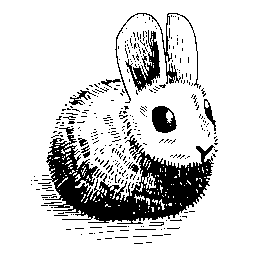

<!-- Logo source: https://harelang.org/mascot.png -->

# Hare

[Hare](https://harelang.org) is a statically typed systems language with manual
memory management and a minimal runtime. It was publicly announced in 2022
after roughly two and a half years of private development. Hare is closest to
C, shares `defer` and some standard-library ideas with Go, and targets operating
systems, command-line tools, compilers, networking software, and other low-level
work.

It remains a young, specialist language rather than a mainstream application
platform. That makes a Convex client an interesting stretch: Hare's standard
library has networking primitives, but this client implements JSON, HTTP, and
WebSockets itself, using OpenSSL through Hare's C ABI only for TLS. This is
unofficial educational material, not an official Convex SDK or a package meant
for production use.

## Getting Started

The canonical [`examples/basics/main.ha`](examples/basics/main.ha) queries a
counter, subscribes before mutating it, and checks the resulting `0 -> 1`
update. From the repository root, Docker builds the exact program shown later
and runs it against a unique room:

```sh
./run verify-example hare
```

## Interesting Parts

### All of JSON is one tagged union

Hare's tagged unions are plain parenthesized lists of types, and
`client/json.ha` uses one to model every document Convex can return. `match`
takes values out: each arm narrows the union to a concrete type, and `yield`
turns the whole `match` into an expression.

```hare
// client/json.ha:
// export type value = (void | bool | i64 | f64 | str | []value | []entry);
const field = convex::lookup(result.value, "count") as *convex::value;
const count = match (*field) {
case let i: i64 =>
	yield i;
case let f: f64 =>
	yield f: i64; // Convex's JSON profile may send 1 or 1.0; accept both.
case =>
	fmt::fatal("demo count was not numeric");
};
// TypeScript: state.count is already a number, thanks to generated types.
```

### Cleanup is a `defer`, not a garbage collector

Hare — started by Drew DeVault of SourceHut fame — borrows `defer` from Go but
pairs it with manual memory management. Every value this client hands out has
a matching `_close` or `_finish`, scheduled on the line right after the one
that acquired it.

```hare
const client = convex::client_init(url) as *convex::client;
defer convex::client_close(client); // Scheduled now, runs at scope exit.

let result = convex::client_call(client, "query", "demo:state", args)
	as convex::call_result;
defer convex::call_result_finish(&result); // Frees the decoded response.
```

Deferred calls run last-to-first, so teardown mirrors setup no matter how many
early returns the function grows later.

### An error is a type with `!` in front

There are no exceptions. A fallible call returns a union such as
`(*client | client_error)`, where the error half is an ordinary type flagged
with `!` — `client_error` is literally `!str`. Each call site chooses to
`match` on the failure or to assert it away with a postfix `!`.

```hare
// client/convex.ha: export type client_error = !str;
const client = match (convex::client_init(url)) {
case let c: *convex::client =>
	yield c;
case let e: convex::client_error =>
	fmt::fatal("could not create the client: {}", e: str);
};

// When crashing is the right response, one character asserts success:
convex::client_set_auth(client, token)!;
```

### One Live step, three possible outcomes

Realtime is Convex's signature, and this client makes the caller drive it: one
call stack owns the WebSocket, and each `client_live_step` advances it by at
most one event. Its return type says everything —
`(sync_event | void | client_error)` — and `match` makes handling all three
outcomes unavoidable.

```hare
// TypeScript: useQuery(api.demo.state, { room }) — React runs this loop.
convex::client_subscribe(client, "counter", "demo:state", args)!;
defer convex::client_unsubscribe(client, "counter")!;

for (true) {
	match (convex::client_live_step(client, 100)) {
	case let event: convex::sync_event =>
		// event.value carries the initial snapshot, then each update.
		break;
	case void =>
		continue; // A quiet 100 ms window; step again.
	case let err: convex::client_error =>
		fmt::fatal("Live step failed: {}", err: str);
	};
};
```

The subscription survives reconnects, and the loop is its own backpressure.

## Status

| Capability | Status |
| --- | --- |
| Native implementation | Verified by shared local and hosted conformance at this exact head (31/31 both profiles) |
| HTTP query, mutation, and action | Verified by shared local and hosted conformance |
| Bearer-token lifecycle | Verified by shared local and hosted conformance |
| Live initial values, updates, unsubscribe, and error recovery | Verified by shared local and hosted conformance |
| Live reconnect | Verified by shared local and hosted conformance, including five real `debugDisconnect`-driven reconnects that each resend the active subscription and correctly suppress a duplicate event for an unchanged rehydrated value |
| Convex tagged values | Deferred, JSON-safe values only |
| Live authentication, optimistic writes, WebSocket mutations/actions | Deferred |

## Example

The full teaching example below is generated directly from the runnable
source.

<!-- BEGIN GENERATED EXAMPLE: examples/basics/main.ha -->
```hare
// A short tour of the native Hare Convex client: an HTTP query, a Live
// subscription started before a mutation so the initial snapshot cannot be
// missed, an idempotent mutation, and the resulting Live update. Every
// printed line is checked against the value Convex actually returned; this
// program exits non-zero if any of them disagree.
use convex;
use fmt;
use os;
use strings;

// Convex's JSON-safe profile may represent a whole number as either an
// integer or a float (for example the literal `0.0`), so the demo counter
// must accept both shapes. A float is only accepted when it is finite,
// mathematically integral, and inside i64's range; NaN, infinities,
// fractional values, and magnitudes that would round when converted are all
// rejected rather than silently truncated.
fn whole_counter(v: convex::value) i64 = {
	match (v) {
	case let i: i64 =>
		return i;
	case let f: f64 =>
		// f64 cannot represent every i64 exactly once magnitudes approach
		// 2^63, so the upper bound below is exclusive: it is the largest
		// power of two that both types can represent, and comparing against
		// it (rather than i64's true maximum) avoids a rounding surprise at
		// the boundary.
		const in_range = f == f && f >= -9223372036854775808.0 && f < 9223372036854775808.0 && f == (f: i64: f64);
		if (!in_range) fmt::fatal("demo count was a non-integral or out-of-range number");
		return f: i64;
	case =>
		fmt::fatal("demo count was not numeric");
	};
};

fn count_of(v: convex::value) i64 = {
	const field = match (convex::lookup(v, "count")) {
	case let p: *convex::value =>
		yield p;
	case void =>
		fmt::fatal("demo state was missing count");
	};
	return whole_counter(*field);
};

// Builds the `{"room": room}` argument object every demo call in this
// example shares.
fn room_args(room: str) convex::value = {
	let entries: []convex::entry = alloc([convex::entry { key = strings::dup("room"), value = strings::dup(room) }]);
	return entries;
};

export fn main() void = {
	// Configure the deployment: the client reads the URL from CONVEX_URL,
	// same as this project's other native clients, and accepts a room name
	// as its first argument so the shared verifier can target a unique room
	// per run.
	const url = match (os::getenv("CONVEX_URL")) {
	case let u: str =>
		yield u;
	case void =>
		fmt::fatal("CONVEX_URL is required");
	};
	const room = if (len(os::args) > 1) os::args[1] else "hare-basic-example";

	// Create the native Hare client.
	const client = match (convex::client_init(url)) {
	case let c: *convex::client =>
		yield c;
	case let e: convex::client_error =>
		fmt::fatal("could not create the client: {}", e: str);
	};
	defer convex::client_close(client);

	// Query the counter through Convex's documented HTTP endpoint.
	let query_args = room_args(room);
	let query_result = match (convex::client_call(client, "query", "demo:state", query_args)) {
	case let r: convex::call_result =>
		yield r;
	case let e: convex::client_error =>
		fmt::fatal("query failed: {}", e: str);
	};
	defer convex::call_result_finish(&query_result);
	const before = count_of(query_result.value);
	fmt::printfln("current count: {}", before)!;

	// Start Live before the mutation so the initial snapshot cannot be
	// missed: subscribing after the mutation could race the server and
	// deliver the post-mutation value as if it were the starting point.
	let subscribe_args = room_args(room);
	match (convex::client_subscribe(client, "example", "demo:state", subscribe_args)) {
	case void => void;
	case let e: convex::client_error =>
		fmt::fatal("subscribe failed: {}", e: str);
	};
	defer convex::client_unsubscribe(client, "example")!;

	// Wait for the actual initial Live value from the bounded event stream.
	const initial_live = wait_for_update(client, "example");
	let initial_live = initial_live;
	defer convex::finish(&initial_live);
	if (count_of(initial_live) != before) {
		fmt::fatal("live initial count did not match the query count");
	};
	fmt::printfln("live initial count: {}", before)!;

	// Apply the mutation with a stable idempotency key, so retrying this
	// example against the same room is always safe.
	let mutation_args: []convex::entry = alloc([
		convex::entry { key = strings::dup("room"), value = strings::dup(room) },
		convex::entry { key = strings::dup("language"), value = strings::dup("Hare") },
		convex::entry { key = strings::dup("runId"), value = strings::dup(strings::concat(room, "-once")) },
	]);
	let mutation_result = match (convex::client_call(client, "mutation", "demo:increment", mutation_args)) {
	case let r: convex::call_result =>
		yield r;
	case let e: convex::client_error =>
		fmt::fatal("mutation failed: {}", e: str);
	};
	defer convex::call_result_finish(&mutation_result);
	const applied = match (convex::lookup(mutation_result.value, "applied")) {
	case let p: *convex::value =>
		yield match (*p) {
		case let b: bool =>
			yield b;
		case =>
			fmt::fatal("mutation response's applied field was not a boolean");
		};
	case void =>
		fmt::fatal("mutation response was missing applied");
	};
	if (!applied) fmt::fatal("mutation was not applied");
	const new_state = match (convex::lookup(mutation_result.value, "state")) {
	case let p: *convex::value =>
		yield *p;
	case void =>
		fmt::fatal("mutation response was missing state");
	};
	const after = count_of(new_state);
	if (after != before + 1) fmt::fatal("mutation count did not advance by exactly one");
	fmt::println("mutation applied: true")!;
	fmt::printfln("mutation count: {}", after)!;

	// Wait for the actual resulting Live value before printing the
	// verification line.
	const updated_live = wait_for_update(client, "example");
	let updated_live = updated_live;
	defer convex::finish(&updated_live);
	if (count_of(updated_live) != after) {
		fmt::fatal("live updated count did not match the mutation count");
	};
	fmt::printfln("live updated count: {}", after)!;
	fmt::printfln("verified count: {} -> {}", before, after)!;
};

// Steps the Live connection until an update arrives for the given
// subscription, or ten seconds pass without one.
fn wait_for_update(client: *convex::client, subscription_id: str) convex::value = {
	let d = convex::deadline_in(10000);
	for (true) {
		if (convex::expired(&d)) fmt::fatal("timed out waiting for a Live update");
		match (convex::client_live_step(client, 100)) {
		case void =>
			continue;
		case let e: convex::sync_event =>
			let e = e;
			if (e.subscription_id != subscription_id) {
				convex::sync_event_finish(&e);
				continue;
			};
			if (e.kind != convex::sync_event_kind::UPDATED) {
				fmt::fatal("subscription failed: {}", e.error_message);
			};
			const value = e.value as convex::value;
			free(e.subscription_id);
			free(e.error_name);
			free(e.error_message);
			match (e.error_data) {
			case let d: convex::value =>
				let d = d;
				convex::finish(&d);
			case void => void;
			};
			match (e.logs) {
			case let l: convex::value =>
				let l = l;
				convex::finish(&l);
			case void => void;
			};
			return value;
		case let err: convex::client_error =>
			fmt::fatal("Live step failed: {}", err: str);
		};
	};
};
```
<!-- END GENERATED EXAMPLE -->

## Implementation Notes

The client is native Hare. [`client/json.ha`](client/json.ha),
[`client/http.ha`](client/http.ha), and [`client/ws.ha`](client/ws.ha)
implement the JSON, HTTP/1.1, and WebSocket layers rather than delegating to
another Convex client. [`client/tls.ha`](client/tls.ha) is the sole C-ABI
boundary and uses OpenSSL's `libssl` for encrypted transport and certificate
verification. All Convex-specific behaviour remains in Hare.

Live is a single-threaded state machine. The caller advances it with
`client_live_step`, which either reconnects, consumes one frame, returns one
decoded event, or reports that its short polling window was quiet. With no
background reader, the step function provides backpressure and the client
holds at most one decoded event between calls.

Hare's build driver has no option to request static linking, so the Docker
build wraps the linker and adds `-static`. It produces `linux/amd64` binaries
with a minimal runtime filesystem and a CA bundle. The test-only conformance
adapter supports both standard input/output and TCP modes, but it is not part
of the educational client API.

For the complete Docker layers, run these from the repository root:

```sh
./run test hare           # offline language-local tests and compilation
./run verify-example hare # the canonical example against a unique room
./run verify hare         # example plus local black-box conformance
./run verify-hosted hare  # the same checks against the hosted target
./run verify-all hare     # both deployment profiles from one build
```

## Known Issues

1. Convex tagged values are deferred, so this client currently accepts only
   JSON-safe values.
2. Live authentication, optimistic writes, WebSocket mutations and actions,
   and `TransitionChunk` assembly are not implemented.
3. Reconnect attempts have no exponential backoff. A persistently unavailable
   deployment is retried on the next `client_live_step` call.
4. Hare 0.24 has no blessed formatter, so the checked-in source is
   hand-formatted. Fragmented incoming WebSocket messages and interleaved
   control frames are implemented, but have not been exercised against an
   adversarial local fixture peer.
