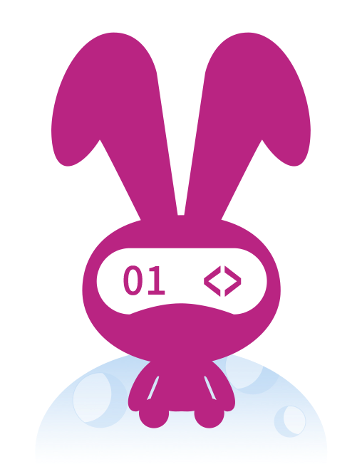

<!-- Logo source: https://www.moonbitlang.com/img/logo.png -->

# MoonBit

[MoonBit](https://www.moonbitlang.com/) is a young, general-purpose language
and toolchain first released publicly in 2023. It began as a WebAssembly-first
language for cloud and edge software, then grew JavaScript, native, and LLVM
backends. Its Rust-like pattern matching and static types sit alongside a
simpler, Go-influenced style, while memory management depends on the selected
backend. The project is still in beta-preview, so it occupies an interesting
niche for developers willing to explore a fast-moving language and its
multi-backend toolchain.

This repository uses MoonBit's native backend to build a real Convex client.
It is an educational, unofficial demonstration, not a production SDK, not a
published package, and not supported by Convex or the MoonBit team.

## Getting Started

Start with [`examples/basics/main.mbt`](examples/basics/main.mbt). It reads a
fresh counter over HTTP, subscribes before changing it, applies an idempotent
mutation, waits for the Live update, and checks that every result agrees on the
same `0 -> 1` journey.

From the repository root, Docker builds the exact canonical example and runs
it against a unique room on the approved local test deployment:

```sh
./run verify-example moonbit
```

Nothing from the MoonBit toolchain needs to be installed on your host.

## Interesting Parts

### A query returns honest JSON, not generated application types

**TypeScript with React**

```tsx
import { api } from "../convex/_generated/api";
import { useQuery } from "convex/react";

export function QueryCounter() {
  const state = useQuery(api.demo.state, { room: "moonbit-readme" });
  if (state === undefined) return <p>Loading...</p>;

  return <p>{state.count}</p>; // `state` and `count` are type-safe here.
}
```

**MoonBit**

```moonbit
async fn query_counter() -> Unit {
  guard @env.get_env_var("CONVEX_URL") is Some(deployment_url) else {
    fail("CONVEX_URL is required")
  }
  guard deployment_url.length() > 0 else { fail("CONVEX_URL must not be empty") }

  let arguments : Map[String, Json] = Map::new()
  arguments["room"] = Json::string("moonbit-readme") // Build the Convex args object.

  @convex.with_client(deployment_url, client => {
    // This is one HTTP request, so it does not stay subscribed.
    let result = client.query("demo:state", Json::object(arguments))
    let count = @convex.integer_value(
      @convex.required_field(result.value, "count", "demo:state"),
      "demo:state count",
    )
    println(count) // The checked decoder has proved this is a whole Int64.
  })
}
```

Convex's React hooks use generated TypeScript types from the backend function.
This small client deliberately supports the JSON-safe value subset instead, so
MoonBit receives `Json` and validates fields at the application boundary. The
helper accepts `0` and `0.0` as the same integer, but rejects fractions, strings,
non-finite values, and overflow instead of silently coercing them.

### React owns reactivity; this client gives you the subscription

**TypeScript with React**

```tsx
import { api } from "../convex/_generated/api";
import { useQuery } from "convex/react";

export function LiveCounter() {
  const state = useQuery(api.demo.state, { room: "moonbit-live-readme" });
  if (state === undefined) return <p>Loading...</p>;

  // React keeps the subscription alive and rerenders when `count` changes.
  return <p>{state.count}</p>;
}
```

**MoonBit**

```moonbit
async fn watch_counter() -> Unit {
  guard @env.get_env_var("CONVEX_URL") is Some(deployment_url) else {
    fail("CONVEX_URL is required")
  }
  guard deployment_url.length() > 0 else { fail("CONVEX_URL must not be empty") }

  let arguments : Map[String, Json] = Map::new()
  arguments["room"] = Json::string("moonbit-live-readme")

  @convex.with_client(deployment_url, client => {
    // The caller owns this subscription and decides when to read each update.
    let subscription = client.subscribe("demo:state", Json::object(arguments))

    guard subscription.next(timeout_ms=20000) is Some(initial) else {
      fail("initial Live value timed out")
    }
    guard initial.value is Some(initial_value) else {
      fail("initial Live query failed")
    }
    println(initial_value.stringify()) // The value current at subscription time.

    guard subscription.next(timeout_ms=20000) is Some(changed) else {
      fail("next Live value timed out")
    }
    guard changed.value is Some(changed_value) else {
      fail("updated Live query failed")
    }
    println(changed_value.stringify()) // A later change, pushed without polling.

    client.unsubscribe(subscription) // Retire it explicitly when finished.
  })
}
```

MoonBit supports asynchronous functions and callbacks. The blocking
`Subscription::next` shape is a choice made by this command-line client, not a
language limitation. It makes ownership and backpressure visible: React hides
the subscription lifecycle behind component mounting and rerenders, while this
caller waits for and disposes each stream itself. See the complete sequencing
and failure checks in the [canonical example](examples/basics/main.mbt).

## Status

| Capability | State | Notes |
| --- | --- | --- |
| HTTP query, mutation, action | Verified locally and hosted | `POST /api/{query,mutation,action}` with the `format=json` encoding. |
| Structured function errors | Verified locally and hosted | Convex `errorData` is forwarded untouched, separately from protocol and transport failures. |
| Bearer token auth | Verified locally and hosted | Sent per request, so clearing it takes effect immediately. |
| TLS | Verified locally and hosted | Certificate chain and hostname verified against the system trust store. |
| Live subscriptions | Verified locally and hosted | Sync WebSocket, one owner, reconnect with rehydration suppression. |
| Live auth, optimistic updates, WebSocket mutations and actions | Not implemented | Deferred; see the known issues below. |
| Tagged Convex value types | Not implemented | The JSON-safe subset only. |

The root-owned shared result evaluator passed against local and hosted
deployments, earning HTTP and Live.

## Example

This block is generated from the runnable source file, so the repository, the
README, and the website always show the same code.

<!-- BEGIN GENERATED EXAMPLE: examples/basics/main.mbt -->
```moonbit
// Convex from MoonBit: the shared counter demonstration.
//
// One room goes from 0 to 1 and every surface agrees about it. The example
// reads the count over Convex's HTTP function endpoint, opens a Live
// subscription over the sync WebSocket, applies a mutation, and then waits for
// the reactive update that the mutation caused. If any of those disagree the
// program fails instead of printing a happy transcript.

///|
/// Build the shared demo's argument object.
///
/// `demo:state` only needs the room. `demo:increment` also takes the language
/// label it records and the idempotency key that makes a retry safe, so those
/// are optional here rather than being two nearly identical builders.
fn room_args(room : String, language? : String, run_id? : String) -> Json {
  let members : Map[String, Json] = Map::new()
  members["room"] = Json::string(room)
  match language {
    Some(value) => members["language"] = Json::string(value)
    None => ()
  }
  match run_id {
    Some(value) => members["runId"] = Json::string(value)
    None => ()
  }
  Json::object(members)
}

///|
/// A random idempotency key for this run.
///
/// `demo:increment` refuses to apply the same `runId` twice, so a retry after a
/// timeout cannot double-count. Falling back to a fixed key would silently turn
/// the mutation into a no-op on a second run against the same room, which is
/// why the failure is loud.
fn fresh_run_id() -> String raise {
  guard @env.rand(16) is Some(raw) else {
    fail("this platform provides no entropy source for an idempotency key")
  }
  let digits = "0123456789abcdef"
  let out = StringBuilder::StringBuilder(size_hint=32)
  for index = 0; index < raw.length(); index = index + 1 {
    let byte = raw[index].to_int()
    out.write_char(digits.unsafe_char_at((byte >> 4) & 0x0f))
    out.write_char(digits.unsafe_char_at(byte & 0x0f))
  }
  out.to_string()
}

///|
/// Read `count` out of a `demo:state` value.
///
/// `@convex.integer_value` accepts an integral number in either `0` or `0.0`
/// form, which Convex's JSON encoding may use interchangeably, and rejects
/// fractional, quoted, non-finite, or overflowing input. Wrapping it here keeps
/// the failure message pointed at the operation that produced the value.
fn count_of(value : Json, what : String) -> Int64 raise {
  @convex.integer_value(
    @convex.required_field(value, "count", what),
    what + " count",
  )
}

///|
/// Wait for the next Live value, refusing to treat a reactive failure as data.
///
/// A Live subscription can deliver a structured failure instead of a value -
/// the query threw, the socket dropped, the server drifted - and a demo that
/// silently retried past one of those would be claiming a reactive guarantee it
/// had not observed.
async fn next_live_count(
  subscription : @convex.Subscription,
  what : String,
) -> Int64 {
  guard subscription.next(timeout_ms=20000) is Some(update) else {
    fail(what + " did not arrive before the deadline")
  }
  match update.error {
    Some(info) =>
      fail(what + " failed: " + info.kind.to_string() + ": " + info.message)
    None => ()
  }
  guard update.value is Some(value) else { fail(what + " carried no value") }
  count_of(value, what)
}

///|
async fn run(url : String, room : String) -> Unit {
  @convex.with_client(url, client => {
    // Read the current count through Convex's documented HTTP endpoint. This
    // is a plain request/response call: no socket, no subscription.
    let current = count_of(
      client.query("demo:state", room_args(room)).value,
      "current",
    )

    // The demonstration is only meaningful from a room nobody has touched.
    guard current == 0L else {
      fail("expected a fresh room, but it already had a count")
    }
    println("current count: " + current.to_string())

    // Subscribe before mutating. Convex delivers the value that is current when
    // the subscription is established and then every value after it, so opening
    // the subscription first is what guarantees the update caused by the
    // mutation below cannot be missed.
    let subscription = client.subscribe("demo:state", room_args(room))

    // The first Live value is the room as it is now, and it has to agree with
    // what HTTP just reported.
    let initial = next_live_count(subscription, "initial Live value")
    guard initial == current else {
      fail("the initial Live value disagreed with the HTTP query")
    }
    println("live initial count: " + initial.to_string())

    // Apply the mutation. The idempotency key is what makes this safe to retry:
    // Convex records it and answers a repeat with `applied: false`.
    let mutation = client.mutation(
        "demo:increment",
        room_args(room, language="MoonBit", run_id=fresh_run_id()),
      ).value
    guard @convex.json_field(mutation, "applied") is Some(True) else {
      fail("the mutation was not applied")
    }
    let mutated = count_of(
      @convex.required_field(mutation, "state", "mutation"),
      "mutation",
    )
    guard mutated == current + 1L else {
      fail("the mutation returned an unexpected count")
    }
    println("mutation applied: true")
    println("mutation count: " + mutated.to_string())

    // The mutation changed data the subscription is watching, so Convex pushes
    // the new value over the same socket. This is the reactive half of the
    // demonstration: nothing polled for it.
    let updated = next_live_count(subscription, "updated Live value")
    guard updated == mutated else {
      fail("the Live update disagreed with the mutation")
    }
    println("live updated count: " + updated.to_string())

    // Retire the subscription now that the proof is complete. Closing the
    // client would do it too, but doing it explicitly is the honest shape for
    // a long-lived program.
    client.unsubscribe(subscription)

    // Only now, with every operation agreeing, is the journey verified.
    println(
      "verified count: " + current.to_string() + " -> " + updated.to_string(),
    )
  })
}

///|
async fn main {
  // Docker supplies the deployment; the verifier supplies a room nobody else is
  // using as the first argument.
  guard @env.get_env_var("CONVEX_URL") is Some(url) else {
    @stdio.stderr.write("MoonBit example failed: CONVEX_URL is required\n") catch {
      _ => ()
    }
    panic()
  }
  let arguments = @env.args()
  let room = if arguments.length() > 1 {
    arguments[1]
  } else {
    // A friendly default for someone running the image by hand.
    match @env.get_env_var("EXAMPLE_ROOM") {
      Some(value) => value
      None => "moonbit-example"
    }
  }
  // A whole-run deadline turns a stalled deployment into a reported failure
  // instead of a container that never exits.
  @async.with_timeout(60000, () => run(url, room)) catch {
    error => {
      @stdio.stderr.write("MoonBit example failed: \{error}\n") catch {
        _ => ()
      }
      panic()
    }
  }
}
```
<!-- END GENERATED EXAMPLE -->

## Implementation Notes

This is a native MoonBit implementation, built with MoonBit
`0.10.6+80dc50f24`. The ordinary networking pieces come from
`moonbitlang/async` 0.20.3: TCP, TLS with system certificate and hostname
verification, HTTP/1.1, and WebSocket framing. The Convex request envelopes,
error categories, Live query tracking, reconnect behaviour, and value decoding
are implemented in MoonBit rather than delegated to another Convex client.

`with_client` uses MoonBit's structured concurrency to keep the Live worker
inside the client's lifetime, including when the callback fails. HTTP calls are
fresh request/response exchanges. Function failures retain Convex's structured
`errorData`, while malformed responses and network failures remain distinct
protocol and transport errors.

Live is more involved. One worker exclusively owns the socket, connection
state, and query-set version. Other tasks submit commands to it, which avoids
concurrent reads or writes changing the order of reactive state. Reconnects
resend active subscriptions, suppress an unchanged replay, and preserve a real
change. Each subscription has a bounded queue; when a slow consumer fills it,
the oldest value is dropped and the drop count remains visible.

The client supports only MoonBit's native target because the selected async
transport does. Its Docker build compiles through the native backend, then
copies the executable and its runtime library closure into a pruned image that
runs as an unprivileged user. The canonical example is a release build, so the
test-only `debugDisconnect` reconnect hook cannot be included in it.

The language-local and shared checks have different jobs:

```sh
./run test moonbit          # Format, type-check, test, and compile in Docker.
./run verify moonbit        # Add local example, image-policy, and conformance checks.
./run verify-hosted moonbit # Repeat against the hosted protocol-drift target.
./run verify-all moonbit    # Run both deployment profiles from one build.
```

The adapter under
[`client/tests/conformance/`](client/tests/conformance/) is test infrastructure,
not part of the educational client API. It lets the shared black-box controller
drive this client in the same way as every other language. The Live encoding it
exercises is an unpublished protocol profile pinned to an upstream revision in
`manifest.yaml`; the pin is evidence for this demonstration, not a promise that
the protocol is stable.

## Known Issues

1. Live authentication, optimistic updates, WebSocket mutations, and WebSocket
   actions are deferred. `set_auth` affects HTTP, and mutations and actions use
   the HTTP endpoints.
2. Values use Convex's JSON-safe `format=json` subset. Tagged Convex value types
   are not implemented.
3. `TransitionChunk` assembly is not implemented. Receiving one is treated as
   protocol drift and causes a reconnect.
4. A subscription keeps at most 16 updates and 1 Mi MoonBit string units of
   serialized payload, with 8 Mi units shared across all subscriptions. String
   units are UTF-16 code units, so the worst-case in-memory ceilings are 2 MiB
   and 16 MiB. Overflow drops the oldest update and increments a visible count.
5. HTTP response bodies and Live messages larger than 2 MiB are refused rather
   than assembled.
6. If a read stops partway through a WebSocket frame, the client abandons that
   connection and reconnects rather than attempting to resume uncertain parser
   state.
