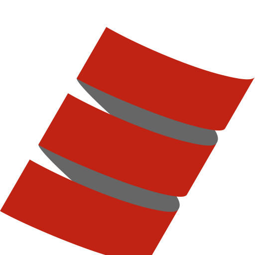

<!-- Logo source: https://www.scala-lang.org/resources/img/scala-logo-large.svg -->

# Scala

[Scala](https://www.scala-lang.org/) is a statically typed language created by
Martin Odersky that combines object-oriented and functional programming. It is
best known for running on the JVM and sharing Java's library ecosystem, though
Scala also targets JavaScript and native code. Since its first public release in
2004, it has found a durable niche in backend, concurrent, distributed, and data
systems.

This repository's Scala 3 client is an educational, unofficial demonstration.
It is not a production SDK and is not supported by Convex.

## Getting Started

Start with [the canonical basic example](examples/basics/Main.scala). It reads a
counter, subscribes before changing it, performs an idempotent mutation, and
then observes the reactive update. From the repository root, this command builds
and runs that exact program in Docker against a unique test room:

```sh
./run verify-example scala
```

## Interesting Parts

### A reactive value has an explicit owner

**TypeScript with React**

```tsx
import { useQuery } from "convex/react";
import { api } from "../convex/_generated/api";

export function Counter() {
  const state = useQuery(api.demo.state, { room: "scala-readme-live" });
  if (state === undefined) return <p>Loading...</p>;

  return <p>{state.count}</p>; // The generated API makes count type-safe here.
}
```

**Scala**

```scala
import convex.{ConvexClient, LiveClient}
import java.time.Duration

@main def observeCounter(): Unit =
  val deploymentUrl = Option(System.getenv("CONVEX_URL"))
    .getOrElse(throw new IllegalStateException("CONVEX_URL is required"))
  // Convex arguments are Jackson JSON nodes in this small client.
  val arguments = ConvexClient.json.createObjectNode().put("room", "scala-readme-live")
  val live = new LiveClient(deploymentUrl)
  try
    val subscription = live.subscribe("demo:state", arguments)
    try
      // next blocks until the initial reactive value arrives or the timeout expires.
      val state = subscription.next(Duration.ofSeconds(10))
      println(state.path("count").intValue()) // count is decoded dynamically here.
    finally subscription.close()
  finally live.close()
```

React owns the `useQuery` subscription and rerenders the component whenever its
value changes. This command-line client exposes a blocking `next` operation, so
the caller owns both the wait and cleanup. That is a deliberate client API
choice, not a limitation of Scala's concurrency features.

### Mutations trade generated types for direct JSON construction

**TypeScript with React**

```tsx
import { useMutation } from "convex/react";
import { api } from "../convex/_generated/api";

export function IncrementButton() {
  const increment = useMutation(api.demo.increment);

  async function handleClick() {
    const result = await increment({
      room: "scala-readme-mutation",
      language: "typescript",
      runId: crypto.randomUUID(),
    });
    console.log(result.state.count); // The generated API checks args and result.
  }

  return <button onClick={handleClick}>Increment</button>;
}
```

**Scala**

```scala
import convex.ConvexClient
import java.util.UUID

@main def incrementCounter(): Unit =
  val deploymentUrl = Option(System.getenv("CONVEX_URL"))
    .getOrElse(throw new IllegalStateException("CONVEX_URL is required"))
  val arguments = ConvexClient.json
    .createObjectNode()
    .put("room", "scala-readme-mutation")
    .put("language", "scala")
    .put("runId", UUID.randomUUID().toString) // Makes a retry idempotent.
  val client = new ConvexClient(deploymentUrl)
  try
    val result = client.mutation("demo:increment", arguments).value
    println(result.path("state").path("count").intValue())
  finally client.close()
```

The Scala call is synchronous and uses a string function path plus Jackson's
dynamic JSON tree. The React client instead gets argument and result types from
Convex's generated API. Scala itself has a rich static type system; dynamic
decoding is simply the scope chosen for this demonstration.

## Status

| Capability | Status |
| --- | --- |
| JSON HTTP queries, mutations, and actions | Verified by shared local and hosted conformance |
| Live query subscriptions | Verified by shared local and hosted conformance |
| Authentication | HTTP bearer tokens only |

## Example

<!-- BEGIN GENERATED EXAMPLE: examples/basics/Main.scala -->
```scala
package convex.example

import convex.{ConvexClient, LiveClient}
import com.fasterxml.jackson.databind.JsonNode
import java.time.Duration
import java.util.UUID

/** The canonical Scala teaching example, installed unchanged in the example image. */
object Main:
  private def count(state: JsonNode, operation: String): Int =
    if !state.path("count").canConvertToInt then
      throw new IllegalStateException(s"$operation did not return a whole count")
    state.path("count").intValue()

  def main(args: Array[String]): Unit =
    // Read configuration supplied by the verifier instead of baking a deployment into the image.
    val url = Option(System.getenv("CONVEX_URL"))
      .getOrElse(throw new IllegalStateException("CONVEX_URL is required"))
    // Use a unique room so another example run cannot alter this counter's journey.
    val room = args.headOption.getOrElse("scala-example")
    val roomArgs = ConvexClient.json.createObjectNode().put("room", room)
    // Keep native HTTP and Live clients scoped together so both clean up on every exit path.
    val client = new ConvexClient(url)
    val live = new LiveClient(url)
    try
      // Query Convex's JSON HTTP API and decode only the count this example needs.
      val before = count(client.query("demo:state", roomArgs).value, "current query")
      // Start Live first, making its initial value the observation point before the mutation.
      val subscription = live.subscribe("demo:state", roomArgs)
      try
        val initial = count(subscription.next(Duration.ofSeconds(10)), "initial Live value")
        if initial != before then throw new IllegalStateException("Live initial value disagreed")
        // This UUID is the idempotency key, so a retry cannot increment the room twice.
        val mutationArgs =
          roomArgs.deepCopy().put("language", "scala").put("runId", UUID.randomUUID().toString)
        val mutation = client.mutation("demo:increment", mutationArgs).value
        val applied = mutation.path("applied").asBoolean()
        val after = count(mutation.path("state"), "mutation")
        if !applied || after != before + 1 then
          throw new IllegalStateException("mutation did not produce the next count")
        // Consume the Live update rather than hiding an out-of-sync subscription with another query.
        val updated = count(subscription.next(Duration.ofSeconds(10)), "updated Live value")
        if updated != after then throw new IllegalStateException("Live update disagreed")
        println(s"current count: $before")
        println(s"live initial count: $initial")
        println(s"mutation applied: $applied")
        println(s"mutation count: $after")
        println(s"live updated count: $updated")
        println(s"verified count: $before -> $updated")
      finally subscription.close()
    finally
      live.close()
      client.close()
```
<!-- END GENERATED EXAMPLE -->

## Implementation Notes

```sh
./run test scala
./run build scala
./run verify-example scala
./run verify scala
./run verify-hosted scala
./run verify-all scala
```

`test` uses Maven inside Docker to format-check and compile Scala 3.3.5, then
runs the language-local acceptance tests. `build` produces separate example and
conformance images for `linux/amd64`. The remaining commands distinguish the
canonical example, local conformance, hosted conformance, and both deployment
profiles. The repository's recorded shared local and hosted evidence earned the
HTTP and Live capabilities shown above.

The native client uses JDK 21's HTTP and WebSocket implementations and Jackson
2.18.2 for JSON. It does not delegate Convex behavior to a JavaScript SDK, the
Convex CLI, or another language client. HTTP queries, mutations, and actions are
blocking calls that preserve Convex logs and distinguish function, protocol,
and transport failures. `setAuth` adds a bearer token to later HTTP calls.

Live targets the pinned `convex-rs-0.10.4-unversioned-sync` profile at
`/api/sync`. One scheduled Scala worker owns socket state, reconnects, and query
set changes. Each subscription exposes `next` and `nextUpdate`, retaining only
the newest 16 pending updates. Language-local tests cover reconnect metadata and
backoff, stale relay barriers, fragmented UTF-8 and control frames, structured
failure recovery, and bounded shutdown. The test-only adapter speaks the shared
NDJSON protocol and provides `debugDisconnect`; neither is part of the public
teaching API.

The runtime image contains a trimmed Java runtime and basic POSIX tools, but no
compiler, Maven, Convex CLI, Node.js, or Python. Both final entrypoints run as
the unprivileged user `65532:65532`.

## Known Issues

1. Live authentication, optimistic updates, journals, and `TransitionChunk`
   assembly are not implemented.
2. A slow subscription consumer keeps only the newest 16 pending updates, so
   older intermediate values can be dropped.
3. Live follows a pinned experimental sync profile. Passing the recorded tests
   is evidence for that profile, not a promise of compatibility with future
   undocumented protocol changes.
