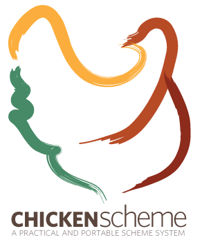

<!-- Logo source: https://wiki.call-cc.org/chicken-small.png -->

# Scheme

[Scheme](https://www.scheme.org/) is a small, dynamically typed language in the Lisp family, [created by Gerald Jay Sussman and Guy Steele in 1975](https://standards.scheme.org/). Its compact, parenthesised syntax treats code and data uniformly, and its support for first-class procedures, proper tail calls, and macros has made it especially influential in programming-language research, teaching, and language tooling. Today its ecosystem spans many implementations rather than one dominant runtime, with both R6RS and R7RS standards in active use.

This client uses [CHICKEN Scheme](https://call-cc.org/), an implementation that translates Scheme to portable C and can produce standalone executables. The project is educational and unofficial. It is not a production Convex SDK and is not intended for package publication.

## Getting Started

Start with [`examples/basics/main.scm`](examples/basics/main.scm). It queries a fresh counter, starts a Live subscription before changing the counter, sends one idempotent mutation, and checks that every result agrees on `0 -> 1`.

From the repository root, run the canonical example in its pinned Docker environment:

```sh
./run verify-example scheme
```

The command builds the minimal example image and runs the exact source shown later in this README against a unique room. You do not need CHICKEN installed on your machine.

## Interesting Parts

### Parentheses make the request structure visible

In React, a generated hook knows the function reference and gives the returned object a static TypeScript type. This Scheme client instead takes the function path as a string and represents a JSON object as alternating key/value arguments to `json-object`.

**TypeScript with React**

```tsx
import { useQuery } from "convex/react";
import { api } from "../convex/_generated/api";

export function QueryCount() {
  const room = "scheme-readme";
  const state = useQuery(api.demo.state, { room });

  if (state === undefined) return <p>Loading...</p>;
  console.log(state.count); // The generated API makes both fields type-safe.
  return <p>{state.count}</p>;
}
```

**Scheme**

```scheme
(import scheme (chicken base) (chicken process-context) convex)

(let ((deployment (get-environment-variable "CONVEX_URL")))
  (unless (and deployment (> (string-length deployment) 0))
    (error 'query-example "CONVEX_URL is required"))
  (let ((client (make-client deployment client-version: "scheme-0.1.0")))
    (dynamic-wind
      (lambda () #t)
      (lambda ()
        (let* ((room "scheme-readme")
               ;; This is a one-off HTTP query, not a reactive subscription.
               (result (client-query client "demo:state"
                                     (json-object "room" room)))
               ;; JSON is dynamic, so read the returned field by its string key.
               (state (result-value result))
               (count (json-get state "count" #f)))
          (print count)))
      ;; The command-line client must release its own resources.
      (lambda () (client-close! client 2.0)))))
```

The nested calls look unusual at first, but each pair of parentheses is just a procedure call. The tradeoff is important: Scheme checks the decoded value at runtime, while the generated TypeScript API catches many shape mistakes before the app runs.

### React owns reactivity, this client hands it to you

`useQuery` subscribes when a component renders and cleans up when it unmounts. The command-line Scheme API exposes that lifecycle directly: create a subscription, block for each update, then close it yourself.

**TypeScript with React**

```tsx
import { useQuery } from "convex/react";
import { api } from "../convex/_generated/api";

export function Counter() {
  const room = "scheme-live-readme";
  const state = useQuery(api.demo.state, { room });

  // React rerenders this component whenever the subscribed value changes.
  return <p>{state === undefined ? "Loading..." : state.count}</p>;
}
```

**Scheme**

```scheme
(import scheme (chicken base) (chicken process-context) convex)

(let ((deployment (get-environment-variable "CONVEX_URL")))
  (unless (and deployment (> (string-length deployment) 0))
    (error 'live-example "CONVEX_URL is required"))
  (let ((client (make-client deployment client-version: "scheme-0.1.0"))
        (subscription #f))
    (dynamic-wind
      (lambda () #t)
      (lambda ()
        ;; The returned handle owns this Live query until it is closed.
        (set! subscription
              (client-subscribe client "demo:state"
                                (json-object "room" "scheme-live-readme")))
        ;; Blocking next is this client's API choice, not a Scheme limitation.
        (let ((update (subscription-next subscription 10.0)))
          (when (and update (not (update-error update)))
            (print (json-get (update-value update) "count" #f)))))
      (lambda ()
        ;; Cleanup runs even if reading or decoding the update raises an error.
        (when subscription (subscription-close! subscription 2.0))
        (client-close! client 2.0)))))
```

CHICKEN supports threads, and Scheme supports higher-order procedures. This client deliberately offers a small blocking `subscription-next` interface so ownership and timeouts stay explicit for a command-line demonstration.

### `0.0` can still be an integer

Convex JSON numbers may decode as an inexact Scheme value such as `1.0`. Scheme's numerical model can still recognise that value as mathematically integral, so the example validates it before converting it to an exact integer.

**TypeScript with React**

```tsx
import { useQuery } from "convex/react";
import { api } from "../convex/_generated/api";

export function SafeCount() {
  const room = "scheme-number-readme";
  const state = useQuery(api.demo.state, { room });

  if (state === undefined) return <p>Loading...</p>;
  if (!Number.isSafeInteger(state.count)) throw new Error("Invalid count");
  return <p>{state.count}</p>; // Convex numbers are JavaScript numbers here.
}
```

**Scheme**

```scheme
(import scheme (chicken base) convex)

(define (count-as-exact-integer state)
  (let ((count (json-get state "count" #f)))
    ;; (integer? 1.0) is true, but 1.5, NaN, and infinity are rejected.
    (unless (and (number? count) (real? count) (integer? count)
                 (<= 0 count 9223372036854775807))
      (error 'count-as-exact-integer "invalid Convex count"))
    (inexact->exact count)))
```

That extra narrowing is not ceremony. It keeps a JSON decoding detail from leaking into later counter arithmetic while still rejecting fractional or out-of-range results.

## Status

| Capability | Status |
| --- | --- |
| HTTP queries, mutations, and actions | Verified by shared local and hosted conformance |
| Bearer authentication and structured function errors | Verified by shared local and hosted conformance |
| Live initial values, updates, and query-error recovery | Verified by shared local and hosted conformance |
| Remove, five reconnects, generation barriers, and bounded delivery | Verified by shared local and hosted conformance |

This is a native implementation. Convex-specific HTTP and Live behaviour is written in Scheme rather than delegated to another Convex client, and the evaluator has awarded both `http` and `live` capabilities.

## Example

<!-- BEGIN GENERATED EXAMPLE: examples/basics/main.scm -->
```scheme
(import scheme
        (chicken base)
        (chicken condition)
        (chicken io)
        (chicken port)
        (chicken process-context)
        srfi-4
        convex)

(define (example-count value operation)
  ;; Generic JSON becomes a Scheme vector of key/value pairs. This program
  ;; narrows the count to the non-negative integer its output contract needs.
  (let ((count (and (json-object? value) (json-get value "count" #f))))
    ;; Convex may encode an integral number as 0.0. Scheme still recognizes
    ;; that as an integer, and the range comparisons reject NaN and infinity.
    (unless (and (number? count) (real? count) (integer? count)
                 (<= 0 count 9223372036854775807))
      (error 'example operation "returned a non-integral or out-of-range count"))
    (inexact->exact count)))

(define (random-hex-id)
  ;; A fresh runId makes the mutation idempotent without delegating randomness
  ;; to a CLI or another runtime.
  (call-with-input-file
   "/dev/urandom"
   (lambda (input)
     (let ((bytes (read-u8vector 16 input))
           (digits "0123456789abcdef"))
       (unless (= (u8vector-length bytes) 16)
         (error 'example "could not read /dev/urandom"))
       (let ((text (make-string 32 #\0)))
         (let loop ((index 0))
           (when (< index 16)
             (let ((byte (u8vector-ref bytes index)))
               (string-set! text (* index 2)
                            (string-ref digits (quotient byte 16)))
               (string-set! text (+ (* index 2) 1)
                            (string-ref digits (modulo byte 16)))
               (loop (+ index 1)))))
         text)))))

(define (next-example-value subscription operation)
  (let ((update (subscription-next subscription 10.0)))
    (unless update (error 'example operation "timed out"))
    (when (update-error update) (raise (update-error update)))
    (update-value update)))

(define (example-condition-text condition)
  (cond
    ((convex-error? condition) (convex-error-message condition))
    ((and (condition? condition)
          ((condition-predicate 'exn) condition))
     (let ((message (get-condition-property condition 'exn 'message #f)))
       (if message
           (with-output-to-string (lambda () (display message)))
           "Scheme exception")))
    (else (with-output-to-string (lambda () (write condition))))))

(define (example-main)
  (let ((deployment (get-environment-variable "CONVEX_URL")))
    (unless (and deployment (> (string-length deployment) 0))
      (error 'example "CONVEX_URL is required"))
    (let* ((arguments (command-line-arguments))
           (room (if (pair? arguments)
                     (car arguments)
                     (or (get-environment-variable "EXAMPLE_ROOM")
                         "scheme-example")))
           ;; Configure one native Scheme client for the deployment supplied
           ;; by the runtime container.
           (client (make-client deployment client-version: "scheme-0.1.0"))
           (subscription #f))
      (dynamic-wind
        (lambda () #t)
        (lambda ()
          ;; Query the current state through Convex's documented HTTP endpoint.
          (let* ((query (client-query client "demo:state"
                                      (json-object "room" room)))
                 (current (example-count (result-value query) "current query")))
            (print "current count: " current)

            ;; Start Live before mutating, so no reactive update is missed.
            (set! subscription
                  (client-subscribe client "demo:state"
                                    (json-object "room" room)))

            ;; The first Live value hydrates the same current query.
            (let ((initial
                    (example-count
                     (next-example-value subscription "initial Live value")
                     "initial Live value")))
              (unless (= initial current)
                (error 'example "initial Live count disagreed with HTTP"))
              (print "live initial count: " initial))

            ;; runId is the mutation's idempotency key. Reusing it returns the
            ;; prior result rather than incrementing twice.
            (let* ((mutation
                     (client-mutation
                      client "demo:increment"
                      (json-object "room" room "language" "scheme"
                                   "runId" (random-hex-id))))
                   (mutation-value (result-value mutation))
                   (applied (json-get mutation-value "applied" #f))
                   (mutation-count
                     (example-count (json-get mutation-value "state" #f)
                                    "mutation"))
                   (expected (+ current 1)))
              (unless (eq? applied #t)
                (error 'example "mutation was not applied"))
              (unless (= mutation-count expected)
                (error 'example "mutation returned an unexpected count"))
              (print "mutation applied: true")
              (print "mutation count: " mutation-count)

              ;; Receive the mutation through Live without polling HTTP.
              (let ((updated
                      (example-count
                       (next-example-value subscription "updated Live value")
                       "updated Live value")))
                (unless (= updated expected)
                  (error 'example "updated Live count disagreed with mutation"))
                (print "live updated count: " updated)

                ;; All three operations agreed before this proof line prints.
                (print "verified count: " current " -> " updated)))))
        (lambda ()
          ;; Cleanup uses acknowledged, bounded owner commands.
          (when subscription
            (handle-exceptions condition #f
              (subscription-close! subscription 2.0)))
          (handle-exceptions condition #f (client-close! client 2.0)))))))

(handle-exceptions condition
  (begin
    (display "Scheme example failed: " (current-error-port))
    (display (example-condition-text condition) (current-error-port))
    (newline (current-error-port))
    (flush-output (current-error-port))
    (exit 1))
  (example-main)
  (exit 0))
```
<!-- END GENERATED EXAMPLE -->

## Implementation Notes

The public client implements Convex's documented JSON HTTP endpoints and the repository's pinned `/api/sync` profile directly in CHICKEN Scheme. HTTP request handling and WebSocket framing are Scheme code over CHICKEN's TCP and OpenSSL bindings. The pinned JSON, SHA-1, base64, and SRFI eggs provide ordinary language facilities, not a delegated Convex implementation. A small pinned patch to the OpenSSL egg adds hostname and IP verification alongside certificate-chain validation.

Live work belongs to one owner thread. Other threads send it subscribe, unsubscribe, reconnect, and close commands, which prevents concurrent code from reading and writing the same socket. The public subscription API then turns delivered updates into a bounded blocking stream. It retains at most 16 recent deliveries under a conservative 20 MiB budget, while active subscription arguments have their own 64-entry and 8 MiB limits.

JSON decoding is also bounded to 2 MiB, 128 nesting levels, and 8,192 structural nodes. Those limits make malformed or unusually dense values fail predictably instead of consuming memory without a ceiling. The test-only adapter has a separate bounded output queue and never becomes part of the public client API.

CHICKEN 5.3.0 compiles the example and adapter to native `linux/amd64` executables. Their final images retain only the executable, TLS libraries and configuration, certificate roots, `/bin/sh`, and the small POSIX command set required by the shared verifier. They run as user `65532:65532` and contain no CHICKEN compiler, package manager, Convex CLI, Node.js, Python, or `curl`.

The repository separates the verification layers:

```sh
./run test scheme
./run verify-example scheme
./run verify scheme
./run verify-hosted scheme
./run verify-all scheme
```

`test` covers formatting, compilation, language-local behaviour, and the canonical example executable inside Docker. `verify-example` checks the teaching program's exact output. The remaining commands add local, hosted, or both shared conformance profiles.

## Known Issues

1. Live authentication, optimistic updates, mutations and actions over WebSockets, journals, and `TransitionChunk` assembly are not implemented. Receiving a `TransitionChunk` retires and reconnects the socket rather than exposing partial state.
2. HTTP uses a bounded connection-close response exchange. Chunked transfer decoding and persistent HTTP connections are not implemented.
3. Values cover Convex's JSON-safe subset. Tagged Convex value encodings are not converted into richer Scheme values.
4. Oversized JSON, too many subscriptions, or delivery pressure can cause rejection or coalescing. These are deliberate memory-safety limits, so this demonstration is not a drop-in general-purpose SDK.
