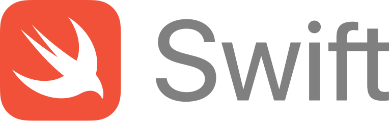

<!-- Logo source: https://www.swift.org/assets/images/swift.svg -->

# Swift

Swift is a compiled, general-purpose language created by Apple and announced in 2014. It is best known for iOS and macOS apps, but the open-source language also targets Linux, Windows, servers, command-line tools, and embedded systems. Its concise syntax will feel more familiar to a TypeScript or C# developer than Objective-C does, while optionals, value types, and actor isolation make safety explicit. See the [official Swift site](https://www.swift.org/), [Apple's history and overview](https://developer.apple.com/swift/get-started/), and [Swift on Server](https://www.swift.org/documentation/server/).

This repository's client is an educational, unofficial demonstration. It is not a production SDK and is not supported by Convex or the Swift project.

## Getting Started

The canonical [`examples/basics/main.swift`](examples/basics/main.swift) program reads a counter over HTTP, opens a Live subscription, applies an idempotent mutation, and observes the resulting update.

From the repository root, run:

```console
./run verify-example swift
```

The command builds and runs the exact example below in Docker against a unique test room. You do not need a host Swift installation.

## Interesting Parts

### A generated React API becomes a string path and JSON dictionary

**TypeScript with React**

```tsx
import { ConvexProvider, ConvexReactClient, useQuery } from "convex/react";
import { api } from "./convex/_generated/api";

const convex = new ConvexReactClient(import.meta.env.VITE_CONVEX_URL);

export function App() {
  return (
    <ConvexProvider client={convex}>
      <Counter />
    </ConvexProvider>
  );
}

function Counter() {
  const state = useQuery(api.demo.state, { room: "swift-readme-http" });
  if (state === undefined) return <p>Loading...</p>;
  return <p>{state.count}</p>; // The generated API types state and count.
}
```

**Swift**

```swift
import Convex
import Foundation

func printCounter() async throws {
  guard let deployment = ProcessInfo.processInfo.environment["CONVEX_URL"] else {
    throw URLError(.badURL)
  }
  let client = try ConvexClient(deployment)
  defer { client.close() }

  // This client uses the deployed function's string path and a JSON dictionary.
  let result = try await client.query("demo:state", ["room": "swift-readme-http"])
  guard
    let state = result.value as? [String: Any],
    let count = state["count"] as? NSNumber
  else { throw URLError(.cannotDecodeContentData) }
  print(count.intValue) // The JSON boundary is dynamic, so decoding is explicit.
}
```

React's `useQuery` stays subscribed and rerenders the component when the value changes. The Swift `query` call above is deliberately one-shot. Swift itself has a rich type system, but this small client exposes JSON as `Any` and does not generate types from the Convex API, so function names and result shapes are checked at runtime. See [`client/Convex.swift`](client/Convex.swift).

### Live updates are an `AsyncStream` that you own

**TypeScript with React**

```tsx
import { ConvexProvider, ConvexReactClient, useQuery } from "convex/react";
import { api } from "./convex/_generated/api";

const convex = new ConvexReactClient(import.meta.env.VITE_CONVEX_URL);

export function App() {
  return (
    <ConvexProvider client={convex}>
      <LiveCounter />
    </ConvexProvider>
  );
}

function LiveCounter() {
  const state = useQuery(api.demo.state, { room: "swift-readme-live" });
  return <p>{state?.count ?? "Loading..."}</p>; // React owns subscription cleanup.
}
```

**Swift**

```swift
import Convex
import Foundation

func printFirstLiveValue() async throws {
  guard let deployment = ProcessInfo.processInfo.environment["CONVEX_URL"] else {
    throw URLError(.badURL)
  }
  let live = try LiveClient(deployment)

  // The command-line client owns both the subscription and its lifetime.
  let subscription = try await live.subscribe(
    "demo:state", ["room": "swift-readme-live"])
  var updates = subscription.stream.makeAsyncIterator()
  if let update = await updates.next(),
    let state = update.value as? [String: Any],
    let count = state["count"] as? NSNumber
  {
    print(count.intValue) // `next()` waits for the initial reactive value.
  }

  await live.unsubscribe(subscription)
  await live.close() // Shutdown is explicit outside a React component lifecycle.
}
```

Swift supports callbacks and other asynchronous designs. Returning an `AsyncStream` is this client's API choice: it fits `async`/`await`, lets `for await` consume later values, and makes ownership clear in a command-line program. Internally, a Swift `actor` serializes the socket, subscription set, and reconnect state. Actors are a language feature for protecting shared mutable state, described in Swift's [official concurrency guide](https://docs.swift.org/swift-book/documentation/the-swift-programming-language/concurrency/).

## Status

| Capability | Status |
| --- | --- |
| HTTP query, mutation, and action | Verified by shared local and hosted conformance |
| Live query updates | Verified by shared local and hosted conformance |
| Authentication | HTTP bearer token only; Live authentication is deferred |

The implementation is native Swift. Foundation provides HTTP, TLS, and JSON handling, while WebSocketKit 2.15.0 and SwiftNIO provide the Live WebSocket transport. No JavaScript Convex client or Convex CLI is delegated behind the API.

## Example

<!-- BEGIN GENERATED EXAMPLE: examples/basics/main.swift -->
```swift
import Convex
import Foundation

@main struct BasicExample {
  static func main() async {
    guard let url = ProcessInfo.processInfo.environment["CONVEX_URL"] else {
      FileHandle.standardError.write(Data("CONVEX_URL is required\n".utf8))
      exit(2)
    }
    let room = CommandLine.arguments.dropFirst().first ?? "swift-example"
    var live: LiveClient?
    var client: ConvexClient?
    do {
      // CONVEX_URL selects the dedicated deployment used by both HTTP and Live.
      let http = try ConvexClient(url)
      client = http
      // Query the room over HTTP before beginning the Live journey.
      let before = try await http.query("demo:state", ["room": room])
      let current = count(before.value)
      print("current count: \(current)")
      // Start Live before mutating, so its first value is an independent snapshot.
      let liveClient = try LiveClient(url)
      live = liveClient
      let sub = try await liveClient.subscribe("demo:state", ["room": room])
      var updates = sub.stream.makeAsyncIterator()
      guard let initial = await updates.next() else {
        throw ExampleError("Live closed before initial value")
      }
      guard initial.error == nil, count(initial.value!) == current else {
        throw ExampleError("unexpected initial Live value")
      }
      print("live initial count: \(current)")
      // The random runId is an idempotency key: retrying this logical mutation will not double increment.
      let mutation = try await http.mutation(
        "demo:increment", ["room": room, "language": "swift", "runId": UUID().uuidString])
      guard let object = mutation.value as? [String: Any], object["applied"] as? Bool == true else {
        throw ExampleError("mutation was not applied")
      }
      let after = count(object["state"]!)
      guard after == current + 1 else { throw ExampleError("unexpected mutation count") }
      print("mutation applied: true")
      print("mutation count: \(after)")
      // Read the Live update caused by the mutation instead of issuing another query.
      guard let updated = await updates.next(), updated.error == nil, count(updated.value!) == after
      else { throw ExampleError("unexpected Live update") }
      print("live updated count: \(after)")
      print("verified count: \(current) -> \(after)")
      // Await Live shutdown so no socket or event-loop work escapes the example.
      await live?.close()
      client?.close()
    } catch {
      await live?.close()
      client?.close()
      FileHandle.standardError.write(Data("\(error)\n".utf8))
      exit(1)
    }
  }
  // Decode only the count teaching value while retaining the client's full JSON fidelity.
  static func count(_ value: Any) -> Int {
    ((value as? [String: Any])?["count"] as? NSNumber)?.intValue ?? -999
  }
  struct ExampleError: Error, CustomStringConvertible {
    let message: String
    init(_ message: String) { self.message = message }
    var description: String { message }
  }
}
```
<!-- END GENERATED EXAMPLE -->

## Implementation Notes

`ConvexClient` uses Foundation's ephemeral `URLSession` to call the documented JSON HTTP endpoints. It sends queries, mutations, and actions with `async throws`, preserves function logs and structured Convex errors, caps HTTP responses at 2 MiB, and can attach a bearer token with `setAuth`. Linux imports `FoundationNetworking`, so the same teaching API compiles in the pinned Swift 6.1.2 Docker toolchain.

`LiveClient` is a Swift actor. One actor owns the WebSocket, query-set changes, reconnection, and shutdown, which prevents concurrent tasks from changing socket state at the same time. WebSocketKit is configured to reassemble fragmented text around control frames and reject oversized messages. Incoming callbacks pass through an eight-event ordered mailbox; each public subscription keeps the newest 16 updates, so memory remains bounded when a consumer is slow. A `QueryFailed` update carries a structured error without permanently ending the stream, and the client reconnects active subscriptions after protocol or transport failures.

The canonical example uses `NSNumber` when reading `count` because Foundation's JSON model is dynamic and Convex JSON numbers can arrive in integral decimal form such as `1.0`. The fuller tests cover HTTP error fidelity, Live recovery, five forced reconnects, bounded buffering, stale-event suppression during unsubscribe or replacement, fragmented UTF-8 WebSocket frames, and adapter event shapes.

For local build coverage, `./run test swift` formats, compiles, and runs the Swift unit tests in Docker. The root-owned `./run verify swift`, `./run verify-hosted swift`, and `./run verify-all swift` commands add shared conformance checks; they are separate from this README-only change.

## Known Issues

1. Live authentication is not implemented. Bearer tokens apply only to HTTP calls.
2. Live WebSocket mutations and actions are deferred; use the HTTP client for those operations.
3. Each subscription keeps only its newest 16 updates, so a slow consumer can miss older intermediate values.
4. Live depends on an undocumented sync profile pinned to a tested backend revision. That protocol may drift and is not an official compatibility promise.
